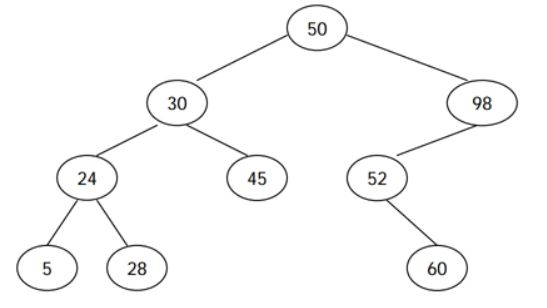
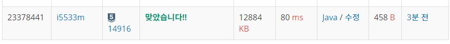

# 이진트리 탐색

문제
이진 검색 트리는 다음과 같은 세 가지 조건을 만족하는 이진 트리이다.

노드의 왼쪽 서브트리에 있는 모든 노드의 키는 노드의 키보다 작다.
노드의 오른쪽 서브트리에 있는 모든 노드의 키는 노드의 키보다 크다.
왼쪽, 오른쪽 서브트리도 이진 검색 트리이다.

<p align="center"> 

</p>


전위 순회 (루트-왼쪽-오른쪽)은 루트를 방문하고, 왼쪽 서브트리, 오른쪽 서브 트리를 순서대로 방문하면서 노드의 키를 출력한다. 후위 순회 (왼쪽-오른쪽-루트)는 왼쪽 서브트리, 오른쪽 서브트리, 루트 노드 순서대로 키를 출력한다. 예를 들어, 위의 이진 검색 트리의 전위 순회 결과는 50 30 24 5 28 45 98 52 60 이고, 후위 순회 결과는 5 28 24 45 30 60 52 98 50 이다.

이진 검색 트리를 전위 순회한 결과가 주어졌을 때, 이 트리를 후위 순회한 결과를 구하는 프로그램을 작성하시오.

입력
트리를 전위 순회한 결과가 주어진다. 노드에 들어있는 키의 값은 106보다 작은 양의 정수이다. 모든 값은 한 줄에 하나씩 주어지며, 노드의 수는 10,000개 이하이다. 같은 키를 가지는 노드는 없다.

출력
입력으로 주어진 이진 검색 트리를 후위 순회한 결과를 한 줄에 하나씩 출력한다.  

## Example1

```
Input: 
50
30
24
5
28
45
98
52
60

Output: 
5
28
24
45
30
60
52
98
50
```

## trial1
### Intuition
```
post 함수를 recursion으로 계속 들어가면서 left를 우선으로 탐색하고 그다음엔 right에 대해서 실행해준다.
이때 트리들을 부분적으로 쪼개서 root와 비교했을때 left에 위치해야하는 node의 index중 최대 index는 mx로 지정하고 풀이를 진행했다.
```
### Codes  
```java
public class Main {
    //static private final String INPUT="C:/spring_workspace/DailyCodingJAVA/input/Main_5639.txt";  
    static ArrayList<Integer> arr;
    static StringBuilder sb=new StringBuilder();
    static void post(int rt,int lst) {
        if(rt>lst) return; 
        int mx=mxidx(rt,lst);
        //int ll=lst;
        post(rt+1,mx);//left에 대해서 먼저 실행하고
        post(mx+1,lst);//right에 대해서 실행하기
        sb.append(arr.get(rt)).append("\n");
    }
    static int mxidx(int rt,int lst) {//left인 인덱스의 끝
        for(int i=rt+1;i<=lst;i++) {
            if(arr.get(rt)<arr.get(i)) {
                return i-1;
            }
        }
        return lst;
    }
    public static void main(String[] args) throws Exception{
        //FileInputStream fs=new FileInputStream(INPUT);
        //System.setIn(fs);
        BufferedReader br=new BufferedReader(new InputStreamReader(System.in));
        StringTokenizer st;
        arr=new ArrayList<Integer>();
        
        String tmp=br.readLine();
        while(tmp!=null) {
            arr.add(Integer.parseInt(tmp));
            tmp=br.readLine();
        }
        post(0,arr.size()-1);
        System.out.println(sb);
    }

}
```

### Results (Performance)  
**Runtime:** 320 ms   
**Memory Usage:**   19664 kb    

<p align="center"> 

</p>


### 문제 URL (백준)  
https://www.acmicpc.net/problem/5639