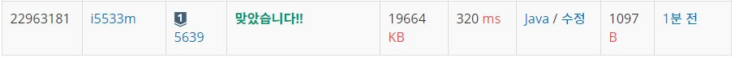

# 거스름돈

문제
춘향이는 편의점 카운터에서 일한다.

손님이 2원짜리와 5원짜리로만 거스름돈을 달라고 한다. 2원짜리 동전과 5원짜리 동전은 무한정 많이 가지고 있다. 동전의 개수가 최소가 되도록 거슬러 주어야 한다. 거스름돈이 n인 경우, 최소 동전의 개수가 몇 개인지 알려주는 프로그램을 작성하시오.

예를 들어, 거스름돈이 15원이면 5원짜리 3개를, 거스름돈이 14원이면 5원짜리 2개와 2원짜리 2개로 총 4개를, 거스름돈이 13원이면 5원짜리 1개와 2원짜리 4개로 총 5개를 주어야 동전의 개수가 최소가 된다.

입력
첫째 줄에 거스름돈 액수 n(1 ≤ n ≤ 100,000)이 주어진다.

출력
거스름돈 동전의 최소 개수를 출력한다. 만약 거슬러 줄 수 없으면 -1을 출력한다.


## Example1

```
Input: 
13

Output: 
5
```

## Example1

```
Input: 
14

Output: 
4
```

## trial1
### Intuition
```
5에 대해서 먼저 돈을 나누고 나눈 몫이 정답이 될 후보가 된다.
0부터 몫까지 모두 돌려가며 2로 나누어 떨어지는 것이 정답 후보이다.
2로 나누어 떨어지는 것중에 동전이 가장 적게 들어가는 것이 답이다.
```
### Codes  
```java

public class Main {

    public static void main(String[] args) throws Exception {
        // TODO Auto-generated method stub
        BufferedReader br=new BufferedReader(new InputStreamReader(System.in));
        int n=Integer.parseInt(br.readLine());
        
        int cnt=500001;
        int div=n/5;
        for(int i=0;i<=div;i++) {
            int cur=n-(5*i);
            if(cur%2==0) {
                cnt=Math.min(cnt,((cur/2)+i) );
            }
        }
        cnt=(cnt==500001?-1:cnt);
        System.out.println(cnt);
    }

}

```

### Results (Performance)  
**Runtime:** 80 ms   
**Memory Usage:**   19664 kb    

<p align="center"> 

</p>


### 문제 URL (백준)  
https://www.acmicpc.net/problem/14916