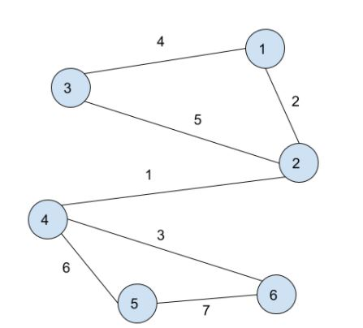
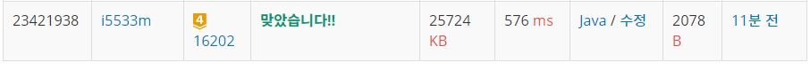

# MST 게임

문제
N개의 정점과 M개의 양방향간선으로 이루어진 단순 그래프 G가 있다. 단순 그래프란, self-loop 간선(한 정점에서 자기 자신을 이어주는 간선)이 없고, 임의의 두 정점 사이 최대 한 개의 간선이 있는 그래프를 말한다. 단순 그래프의 스패닝 트리(Spanning Tree)는 다음 조건을 만족하는 간선의 집합이다.

스패닝 트리를 구성하는 간선의 개수는 N-1개이다.
그래프의 임의의 두 정점을 골랐을 때, 스패닝 트리에 속하는 간선만 이용해서 두 정점을 연결하는 경로를 구성할 수 있어야 한다.
스패닝 트리 중에서 간선의 가중치의 합이 최소인 것을 최소 스패닝 트리(Minimum Spanning Tree, MST)라고 부른다.

이제 그래프에서 MST 게임을 하려고 한다.

MST 게임은 그래프에서 간선을 하나씩 제거하면서 MST의 비용을 구하는 게임이다. MST의 비용이란 MST를 이루고 있는 가중치의 합을 의미한다. 각 턴의 점수는 해당 턴에서 찾은 MST의 비용이 된다. 
이 과정은 K턴에 걸쳐서 진행되며, 첫 턴에는 입력으로 주어진 그래프의 MST 비용을 구해야 한다.
각 턴이 종료된 후에는 그 턴에서 구한 MST에서 가장 가중치가 작은 간선 하나를 제거한다.
한 번 제거된 간선은 이후의 턴에서 사용할 수 없다.
어떤 턴에서 MST를 만들 수 없다면, 그 턴의 점수는 0이다. 당연히 이후 모든 턴의 점수도 0점이다. 첫 턴에 MST를 만들 수 없는 경우도 있다.
양방향 간선으로 이루어진 단순 그래프와 K가 주어졌을 때, 각 턴의 점수가 몇 점인지 구하는 프로그램을 작성하시오.

입력
첫째 줄에 그래프 정점의 개수 N, 그래프 간선의 개수 M, 턴의 수 K가 주어진다. (2 ≤ N ≤ 1,000, 1 ≤ M ≤ min(10,000, N×(N-1)/2), 1 < K ≤ 100)

그 후 M개의 줄에 간선의 정보가 주어진다. 간선의 정보는 간선을 연결하는 두 정점의 번호 x, y로 이루어져 있다. 같은 간선이 여러 번 주어지는 경우는 없다. 간선의 가중치는 주어지는 순서대로 1, 2, ..., M이다.

정점의 번호는 1부터 N까지로 이루어져 있다.

출력
한 줄에 공백으로 구분하여 K개의 정수를 출력해야 한다. K개의 정수는 각 턴에 얻는 점수를 나타낸다. 


<p align="center"> 

</p>

## Example1

```
Input: 
6 6 2
1 2
2 3
1 3
4 5
5 6
4 6

Output: 
0 0
```

## Example2

```
Input: 
6 7 3
2 4
1 2
4 6
1 3
2 3
4 5
5 6

Output: 
16 0 0
```

## Example3

```
Input: 
4 5 4
3 4
1 3
1 4
1 2
2 4

Output: 
7 9 0 0
```

## trial1
### Intuition
```
MST의 크루스칼 알고리즘의 개념을 활용한 문제이다.
크루스칼 알고리즘은 모든 간선에서 가장 짧은것 순서대로 연결여부를 확인하면서 같은 그래프에
이미 연결되어있는 경우에는 연결해줄 필요가 없고
아직 연결되어있지 않은 node들의 간선이라면 union이라는 함수를 사용해 연결시켜준다.

이 문제에서 간선의 weight는 순서라고 할 수 있다.
priority queue의 깊은 복사를 활용해서 이전의 간선과 연결 node들의 집합을 계속 저장해주고 priority queue를 weight를 기준으로 짧은 간선부터 정렬시키도록 한다.
이렇게 하면 가장 짧은 간선을 하나씩 뺄때 O(1) 시간이 걸리도록 할 수 있다.
MST가 생성이 되지 않을때까지 간선을 하나씩 삭제하면서 연결 여부를 확인하면 된다.
```
### Codes  
```java
public class Main_16202 {
        static class con implements Comparable<con>{
        int x;
        int y;
        int w;
        @Override
        public int compareTo(con b) {
            return this.w-b.w;
        }
    }
    static public int getParent(int parent[],int x) {
        if(parent[x]==x) return x;
        return parent[x]=getParent(parent,parent[x]);
    }
    static public void union(int parent[],int x, int y) {
        x=getParent(parent,x);
        y=getParent(parent,y);
        if(x<y) parent[y]=x;
        else parent[x]=y;
    }
    static public boolean isConnected(int parent[],int x,int y) {
        x=getParent(parent,x);
        y=getParent(parent,y);
        if(x==y) return true;
        return false;
    }
    public static void main(String[] args) throws Exception {
        // TODO Auto-generated method stub
        FileInputStream fs=new FileInputStream(INPUT);
        System.setIn(fs);
        BufferedReader br=new BufferedReader(new InputStreamReader(System.in));
        StringTokenizer st=new StringTokenizer(br.readLine());
        int N=Integer.parseInt(st.nextToken());
        int M=Integer.parseInt(st.nextToken());
        int K=Integer.parseInt(st.nextToken());
        StringBuilder sb=new StringBuilder();
        
        int parent[]=new int[N+1];
        PriorityQueue<con> q=new PriorityQueue<con>();
        PriorityQueue<con> tmp=new PriorityQueue<con>();
        
        for(int i=1;i<=N;i++) {
            parent[i]=i;
        }
        for(int i=1;i<=M;i++) {
            st=new StringTokenizer(br.readLine());
            con c=new con();
            c.x=Integer.parseInt(st.nextToken());
            c.y=Integer.parseInt(st.nextToken());
            c.w=i;
            tmp.offer(c);
        }
        int cnt;
            for(int i=0;i<K;i++) {//횟수
                cnt=1;
                q.clear();
                q.addAll(tmp);
                int total=0;
                parent=new int[N+1];
                for(int z=1;z<=N;z++) {
                    parent[z]=z;
                }
                while(!q.isEmpty()) {
                    con cur=q.poll();
                    if(!isConnected(parent,cur.x,cur.y)) {
                        union(parent,cur.x,cur.y);
                        cnt++;
                        total+=cur.w;
                    }
                    if(cnt==N) break;
                }
                if(cnt!=N) {
                    for(int j=i;j<K;j++) {
                        sb.append(0).append(" ");
                    }
                    break;
                }else {
                    sb.append(total).append(" ");
                }
                tmp.poll();
            }
        
        System.out.println(sb);
        
    }

}

```

### Results (Performance)  
**Runtime:** 576 ms   
**Memory Usage:**   25724 kb    

<p align="center"> 

</p>


### 문제 URL (백준)  
https://www.acmicpc.net/problem/16202