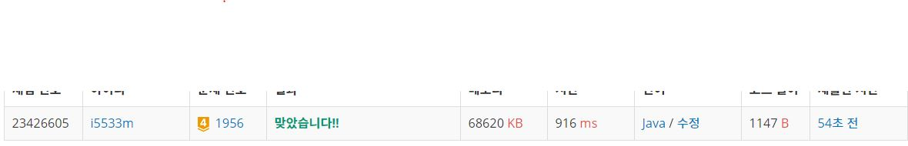

# 운동

문제  
V개의 마을와 E개의 도로로 구성되어 있는 도시가 있다. 도로는 마을과 마을 사이에 놓여 있으며, 일방 통행 도로이다. 마을에는 편의상 1번부터 V번까지 번호가 매겨져 있다고 하자.  

당신은 도로를 따라 운동을 하기 위한 경로를 찾으려고 한다. 운동을 한 후에는 다시 시작점으로 돌아오는 것이 좋기 때문에, 우리는 사이클을 찾기를 원한다. 단, 당신은 운동을 매우 귀찮아하므로, 사이클을 이루는 도로의 길이의 합이 최소가 되도록 찾으려고 한다.  

도로의 정보가 주어졌을 때, 도로의 길이의 합이 가장 작은 사이클을 찾는 프로그램을 작성하시오. 두 마을을 왕복하는 경우도 사이클에 포함됨에 주의한다.  

입력  
첫째 줄에 V와 E가 빈칸을 사이에 두고 주어진다. (2 ≤ V ≤ 400, 0 ≤ E ≤ V(V-1)) 다음 E개의 줄에는 각각 세 개의 정수 a, b, c가 주어진다. a번 마을에서 b번 마을로 가는 거리가 c인 도로가 있다는 의미이다. (a → b임에 주의) 거리는 10,000 이하의 자연수이다. (a, b) 쌍이 같은 도로가 여러 번 주어지지 않는다.  

출력
첫째 줄에 최소 사이클의 도로 길이의 합을 출력한다. 운동 경로를 찾는 것이 불가능한 경우에는 -1을 출력한다.  


## Example1

```
Input: 
3 4
1 2 1
3 2 1
1 3 5
2 3 2

Output: 
3
```


## trial1
### Intuition
```
사이클중에 가장 경로가 적은 사이클을 구하는 문제이고 플로이드 워셔를 사용해서 해결할수 있다.
우선 2차원 그래프를 사용해서 모두 내가 정의한 INF로 초기화를 시켜준다.
그리고 flowdwarshall 함수를 돌리는데 이함수는 시작 node, 중간 node, 끝 node에 대해서 중간 node를
거쳐가는 것이 짧은지 거쳐가지 않는 것이 빠른지 결정해 최상의 경로를 찾아서 시작node와 끝node에 대한 
거리를 계속 갱신해주는 방식으로 구현한다.

그리고 사이클을 찾는 문제이기때문에 시작 node와 끝 node가 같으면 자신으로 돌아오는 최상의 거리를 찾을수 있다.

```
### Codes  
```java
public class Main {
    static int graph[][];
    static int INF=1000000000;
    static int res=INF;
    public static void FloydWar() {
        for (int k = 0; k < graph.length; k++) {
            for (int i = 0; i < graph.length; i++) {
                for(int j=0;j<graph.length;j++) {
                    graph[i][j]=Math.min(graph[i][k]+graph[k][j],graph[i][j]);
                }
            }
        }
    }

    public static void main(String[] args) throws Exception {
        BufferedReader br = new BufferedReader(new InputStreamReader(System.in));
        StringTokenizer st = new StringTokenizer(br.readLine());
        int V = Integer.parseInt(st.nextToken());
        int E = Integer.parseInt(st.nextToken());
        graph = new int[V+1][V+1];
        for(int i=0;i<=V;i++) {
            for(int j=0;j<=V;j++) {
                graph[i][j]=INF;
            }
        }
        for (int i = 0; i < E; i++) {
            st = new StringTokenizer(br.readLine());
            int x, y;
            x = Integer.parseInt(st.nextToken());
            y = Integer.parseInt(st.nextToken());
            graph[y][x] = Integer.parseInt(st.nextToken());
        }
        FloydWar();
        for(int i=1;i<=V;i++) {
            res=Math.min(graph[i][i],res);
        }
        if(res==INF) System.out.println(-1);
        else System.out.println(res);
    }

}
```

### Results (Performance)  
**Runtime:** 916 ms   
**Memory Usage:**   68620 kb    

<p align="center"> 

</p>


### 문제 URL (백준)  
https://www.acmicpc.net/problem/1956