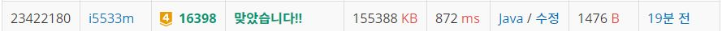

# 행성 연결

문제
홍익 제국의 중심은 행성 T이다. 제국의 황제 윤석이는 행성 T에서 제국을 효과적으로 통치하기 위해서, N개의 행성 간에 플로우를 설치하려고 한다.

두 행성 간에 플로우를 설치하면 제국의 함선과 무역선들은 한 행성에서 다른 행성으로 무시할 수 있을 만큼 짧은 시간만에 이동할 수 있다. 하지만, 치안을 유지하기 위해서 플로우 내에 제국군을 주둔시켜야 한다.

모든 행성 간에 플로우를 설치하고 플로우 내에 제국군을 주둔하면, 제국의 제정이 악화되기 때문에 황제 윤석이는 제국의 모든 행성을 연결하면서 플로우 관리 비용을 최소한으로 하려 한다.

N개의 행성은 정수 1,…,N으로 표시하고, 행성 i와 행성 j사이의 플로우 관리비용은 Cij이며, i = j인 경우 항상 0이다.

제국의 참모인 당신은 제국의 황제 윤석이를 도와 제국 내 모든 행성을 연결하고, 그 유지비용을 최소화하자.  이때 플로우의 설치비용은 무시하기로 한다.

입력
입력으로 첫 줄에 행성의 수 N (1 ≤ N ≤ 1000)이 주어진다.

두 번째 줄부터 N+1줄까지 각 행성간의 플로우 관리 비용이 N x N 행렬 (Cij),  (1 ≤ i, j ≤ N, 1 ≤ Cij ≤ 100,000,000, Cij = Cji) 로 주어진다.

출력
모든 행성을 연결했을 때, 최소 플로우의 관리비용을 출력한다.


## Example1

```
Input: 
3
0 2 3
2 0 1
3 1 0

Output: 
3
```

## Example1

```
Input: 
5
0 6 8 1 3
6 0 5 7 3
8 5 0 9 4
1 7 9 0 6
3 3 4 6 0

Output: 
11
```

## trial1
### Intuition
```
MST의 크루스칼 알고리즘의 개념을 활용한 문제이다.
크루스칼 알고리즘은 모든 간선에서 가장 짧은것 순서대로 연결여부를 확인하면서 같은 그래프에
이미 연결되어있는 경우에는 연결해줄 필요가 없고
아직 연결되어있지 않은 node들의 간선이라면 union이라는 함수를 사용해 연결시켜준다.

여기서 union함수와 getParent, isConected는 parent를 사용한 MST 풀이법이다.
union은 여기서 기준을 더 작은 숫자의 parent를 갖도록 했다. 그리고 각각의 parent를 구하여 서로 연결해주는 작업을 한것이다.
getParent는 recuesion를 활용해서 가장 최상위(root) 부모를 찾아주는 함수이고 리턴하는 과정에서 parent를 계속 업데이트 시켜주어 최대한 recursion 하는 시간을 단축시키도록 햇다.
isConnected 함수는 두 node가 서로 연결되어있는지를 확인하는 것으로 root parent가 둘이 같다면 연결된 것이라고 할 수 있다. 
```
### Codes  
```java
static class con implements Comparable<con>{
    int x;
    int y;
    int w;
    @Override
    public int compareTo(con b) {
        return this.w-b.w;//positive면 자리바꿈
    }
}
static private int getParent(int parent[],int x) {
    if(parent[x]==x) return x;
    return parent[x]=getParent(parent,parent[x]);
}
static private void union(int parent[],int x,int y) {
    x=getParent(parent,x);
    y=getParent(parent,y);
    if(x>y) parent[x]=y;
    else parent[y]=x;
}
static private boolean isConnected(int parent[],int x,int y) {
    x=getParent(parent,x);
    y=getParent(parent,y);
    if(x==y) return true;
    return false;
}
static private PriorityQueue<con> q=new PriorityQueue<con>();

    static private String INPUT="C:/spring_workspace/DailyCodingJAVA/input/Main_16398.txt"; 
    public static void main(String[] args) throws Exception{
        // TODO Auto-generated method stub
        FileInputStream fs=new FileInputStream(INPUT);
        System.setIn(fs);
        BufferedReader br=new BufferedReader(new InputStreamReader(System.in));
        StringTokenizer st;
        int n=Integer.parseInt(br.readLine());
        
        int parent[]=new int[n];
        for(int i=0;i<n;i++) {
            st=new StringTokenizer(br.readLine());
            parent[i]=i;
            for(int j=0;j<n;j++) {
                int w=Integer.parseInt(st.nextToken());
                if(i<j) {
                    con c=new con();
                    c.x=j;
                    c.y=i;
                    c.w=w;
                    q.offer(c);
                }
            }
        }
        long cnt=0;
        long price=0;
        while(!q.isEmpty()) {
            con cur=q.poll();
            if(!isConnected(parent,cur.x,cur.y)) {
                union(parent,cur.x,cur.y);
                cnt++;
                price+=cur.w;
            }
            if(cnt==n) break;
            
        }
        System.out.println(price);
        
    }

}
```

### Results (Performance)  
**Runtime:** 80 ms   
**Memory Usage:**   19664 kb    

<p align="center"> 

</p>


### 문제 URL (백준)  
https://www.acmicpc.net/problem/14916