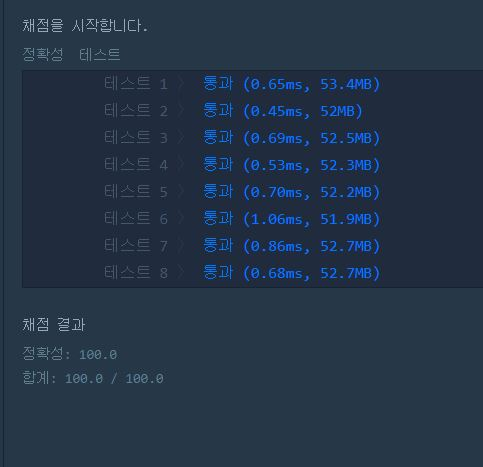

# 섬의 연결

문제 설명
n개의 섬 사이에 다리를 건설하는 비용(costs)이 주어질 때, 최소의 비용으로 모든 섬이 서로 통행 가능하도록 만들 때 필요한 최소 비용을 return 하도록 solution을 완성하세요.

다리를 여러 번 건너더라도, 도달할 수만 있으면 통행 가능하다고 봅니다. 예를 들어 A 섬과 B 섬 사이에 다리가 있고, B 섬과 C 섬 사이에 다리가 있으면 A 섬과 C 섬은 서로 통행 가능합니다.

제한사항

섬의 개수 n은 1 이상 100 이하입니다.
costs의 길이는 ((n-1) * n) / 2이하입니다.
임의의 i에 대해, costs[i][0] 와 costs[i] [1]에는 다리가 연결되는 두 섬의 번호가 들어있고, costs[i] [2]에는 이 두 섬을 연결하는 다리를 건설할 때 드는 비용입니다.
같은 연결은 두 번 주어지지 않습니다. 또한 순서가 바뀌더라도 같은 연결로 봅니다. 즉 0과 1 사이를 연결하는 비용이 주어졌을 때, 1과 0의 비용이 주어지지 않습니다.
모든 섬 사이의 다리 건설 비용이 주어지지 않습니다. 이 경우, 두 섬 사이의 건설이 불가능한 것으로 봅니다.
연결할 수 없는 섬은 주어지지 않습니다.
입출력 예

입출력 예 설명

costs를 그림으로 표현하면 다음과 같으며, 이때 초록색 경로로 연결하는 것이 가장 적은 비용으로 모두를 통행할 수 있도록 만드는 방법입니다.

## Example1

```
n           costs                                return
4   [[0,1,1],[0,2,2],[1,2,5],[1,3,1],[2,3,8]]   4
```


## trial1
### Intuition
```
MST의 크루스칼 알고리즘의 개념을 활용한 문제이다.
크루스칼 알고리즘은 모든 간선에서 가장 짧은것 순서대로 연결여부를 확인하면서 같은 그래프에
이미 연결되어있는 경우에는 연결해줄 필요가 없고
아직 연결되어있지 않은 node들의 간선이라면 union이라는 함수를 사용해 연결시켜준다.

여기서 union함수와 getParent, isConected는 parent를 사용한 MST 풀이법이다.
union은 여기서 기준을 더 작은 숫자의 parent를 갖도록 했다. 그리고 각각의 parent를 구하여 서로 연결해주는 작업을 한것이다.
getParent는 recuesion를 활용해서 가장 최상위(root) 부모를 찾아주는 함수이고 리턴하는 과정에서 parent를 계속 업데이트 시켜주어 최대한 recursion 하는 시간을 단축시키도록 햇다.
isConnected 함수는 두 node가 서로 연결되어있는지를 확인하는 것으로 root parent가 둘이 같다면 연결된 것이라고 할 수 있다. 
```
### Codes  
```java
import java.util.*;

class Solution {
    static class block implements Comparable<block>{
        int x;
        int y;
        int w;
        @Override
        public int compareTo(block b){
            return this.w-b.w;
        }
    }
    static public int getParent(int parent[], int x){
    if(parent[x]==x) return x;
    return parent[x]=getParent(parent,parent[x]);
}
static public boolean isConnected(int parent[],int x,int y){
    x=getParent(parent,x);
    y=getParent(parent,y);
    if(x==y) return true;
    return false;
}
static public void Union(int parent[],int x,int y){
    x=getParent(parent,x);
    y=getParent(parent,y);
    if(x<y) parent[y]=x;
    else parent[x]=y;
}
    public int solution(int n, int[][] costs) {
        int answer = 0;
        int parent[]=new int[n];
        for(int i=0;i<n;i++){
            parent[i]=i;
        }
        PriorityQueue<block> q=new PriorityQueue<>();
        for(int i=0;i<costs.length;i++){
            block b=new block();
            b.x=costs[i][0];
            b.y=costs[i][1];
            b.w=costs[i][2];
            q.offer(b);
        }
        while(!q.isEmpty()){
            block cur=q.poll();
            if(!isConnected(parent,cur.x,cur.y)){
                 Union(parent,cur.x,cur.y);
                answer+=cur.w;
            }
        }
        return answer;
    }
}
```

### Results (Performance)  

<p align="center"> 

</p>


### 문제 URL (백준)  
https://programmers.co.kr/learn/courses/30/lessons/42861