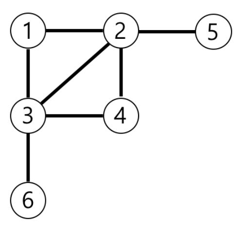
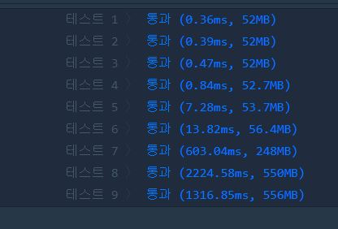

# 가장 먼 노드

문제 설명
n개의 노드가 있는 그래프가 있습니다. 각 노드는 1부터 n까지 번호가 적혀있습니다. 1번 노드에서 가장 멀리 떨어진 노드의 갯수를 구하려고 합니다. 가장 멀리 떨어진 노드란 최단경로로 이동했을 때 간선의 개수가 가장 많은 노드들을 의미합니다.

노드의 개수 n, 간선에 대한 정보가 담긴 2차원 배열 vertex가 매개변수로 주어질 때, 1번 노드로부터 가장 멀리 떨어진 노드가 몇 개인지를 return 하도록 solution 함수를 작성해주세요.

제한사항
노드의 개수 n은 2 이상 20,000 이하입니다.
간선은 양방향이며 총 1개 이상 50,000개 이하의 간선이 있습니다.
vertex 배열 각 행 [a, b]는 a번 노드와 b번 노드 사이에 간선이 있다는 의미입니다.
입출력 예
n   vertex  return
6   [[3, 6], [4, 3], [3, 2], [1, 3], [1, 2], [2, 4], [5, 2]]    3
입출력 예 설명
예제의 그래프를 표현하면 아래 그림과 같고, 1번 노드에서 가장 멀리 떨어진 노드는 4,5,6번 노드입니다.

<p align="center"> 

</p>


## Example1

```
n           costs                                return
4   [[0,1,1],[0,2,2],[1,2,5],[1,3,1],[2,3,8]]   4
```


## trial1
### Intuition
```
BFS를 사용해서 풀이했다. 가장 먼 노드의 개수를 구하는 것이기 때문에 1부터 시작해서 연결되어있는 node로
퍼져나가며 count가 바껴서 새로은 level의 node에 도달할때마다 큐에 들어있는 child들의 개수들을 세어서
문제를 해결하는 방식이다.

PriorityQueue와 Queue 둘 모두 사용해서 문제를 풀이해봤는데 Queue가 더 빨랐다.
그이유는 어차피 bfs방식은 FIFO 방법이기 대문에 먼저 연결되어있는 상위 level부터 하위 level로 가는 것이므로
굳이 PriorityQueue를 사용하지 않아도 상위 level부터 세어주어 level이 바뀔때 쯤에는 이미 상위 node는 모두
방문한 것이 되므로 하위 node들의 개수만 queue에 남아있게 된다.
```
### Codes  
```java
class Solution {
    static class block implements Comparable<block>{
        int val;
        int cnt=0;
        @Override
        public int compareTo(block a){
            return this.cnt-a.cnt;
        }
    }
    public int solution(int n, int[][] edge) {
        int answer = 0;
        boolean visit[]=new boolean[n+1];
        boolean graph[][]=new boolean[n+1][n+1];
        for(int i=0;i<edge.length;i++){
            graph[edge[i][0]][edge[i][1]]=true;
            graph[edge[i][1]][edge[i][0]]=true;
        }
       // PriorityQueue<block> q=new PriorityQueue<>();
        Queue<block> q=new LinkedList<>();// -> 이게 더 효율이 좋음
        block cur=new block();
        cur.val=1;
        cur.cnt=1;
        visit[1]=true;
        q.offer(cur);//1부터 시작
        int nwcnt=0;
        while(!q.isEmpty()){
            cur=q.poll();
            if(nwcnt!=cur.cnt){
                //System.out.println(cur.val+"(cnt):"+(q.size()+1));
                answer=q.size()+1;//현재 카운트에 1추가
                nwcnt=cur.cnt;
            }
            for(int i=1;i<=n;i++){
                if(!visit[i] && graph[cur.val][i]){//연결 여부와 방문 했는지 확인
                    visit[i]=true;
                    block nwb=new block();
                    nwb.val=i;
                    nwb.cnt=cur.cnt+1;
                    //System.out.println(cur.val+":"+i+","+nwb.val+","+nwb.cnt);
                    q.offer(nwb);
                }
            }
        }
        return answer;
    }
}
```

### Results (Performance)  

<p align="center"> 

</p>


### 문제 URL (백준)  
https://programmers.co.kr/learn/courses/30/lessons/49189