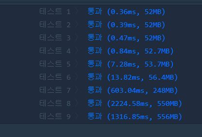

# 단속카메라

문제 설명
고속도로를 이동하는 모든 차량이 고속도로를 이용하면서 단속용 카메라를 한 번은 만나도록 카메라를 설치하려고 합니다.

고속도로를 이동하는 차량의 경로 routes가 매개변수로 주어질 때, 모든 차량이 한 번은 단속용 카메라를 만나도록 하려면 최소 몇 대의 카메라를 설치해야 하는지를 return 하도록 solution 함수를 완성하세요.

제한사항

차량의 대수는 1대 이상 10,000대 이하입니다.
routes에는 차량의 이동 경로가 포함되어 있으며 routes[i][0]에는 i번째 차량이 고속도로에 진입한 지점, routes[i][1]에는 i번째 차량이 고속도로에서 나간 지점이 적혀 있습니다.
차량의 진입/진출 지점에 카메라가 설치되어 있어도 카메라를 만난것으로 간주합니다.
차량의 진입 지점, 진출 지점은 -30,000 이상 30,000 이하입니다.
입출력 예


## Example1

```
routes  return
[[-20,15], [-14,-5], [-18,-13], [-5,-3]]    2
```


## trial1
### Intuition
```
BFS를 사용해서 풀이했다. 가장 먼 노드의 개수를 구하는 것이기 때문에 1부터 시작해서 연결되어있는 node로
퍼져나가며 count가 바껴서 새로은 level의 node에 도달할때마다 큐에 들어있는 child들의 개수들을 세어서
문제를 해결하는 방식이다.

PriorityQueue와 Queue 둘 모두 사용해서 문제를 풀이해봤는데 Queue가 더 빨랐다.
그이유는 어차피 bfs방식은 FIFO 방법이기 대문에 먼저 연결되어있는 상위 level부터 하위 level로 가는 것이므로
굳이 PriorityQueue를 사용하지 않아도 상위 level부터 세어주어 level이 바뀔때 쯤에는 이미 상위 node는 모두
방문한 것이 되므로 하위 node들의 개수만 queue에 남아있게 된다.
```
### Codes  
```java
import java.util.*;
class Solution {
    boolean visit[];
    static class block{
        int mn;
        int mx;
    }
    public int solution(int[][] routes) {
        int answer = 0;
        visit=new boolean[routes.length];
        ArrayList<block> arr=new ArrayList<>();
        block b=new block();
        b.mn=routes[0][0];
        b.mx=routes[0][1];
        arr.add(b);
        for(int i=1;i<routes.length;i++){
            boolean nw=false;
            for(int j=0;j<arr.size();j++){
                //System.out.println(arr.get(j).mn+","+arr.get(j).mx);
                if(arr.get(j).mn>routes[i][1] || arr.get(j).mx<routes[i][0]){//새로온애가 범위를 벗어난다면?
                    continue;
                }else{
                    nw=true;//겹치는 부분이 있는경우
                    //최소 범위로 줄여나가기
                    arr.get(j).mn=Math.max(arr.get(j).mn,routes[i][0]);
                    arr.get(j).mx=Math.min(arr.get(j).mx,routes[i][1]);
                    break;
                }
            }
            if(!nw){//새로운 block 추가
                b=new block();
                b.mn=routes[i][0];
                b.mx=routes[i][1];
                //System.out.println("nw:"+b.mn+","+b.mx);
                arr.add(b);
            }
        }
        answer=arr.size();
        return answer;
    }
}
```

### Results (Performance)  

<p align="center"> 

</p>


### 문제 URL (백준)  
https://programmers.co.kr/learn/courses/30/lessons/49189