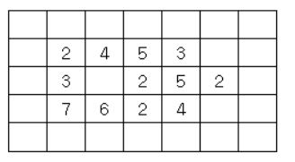
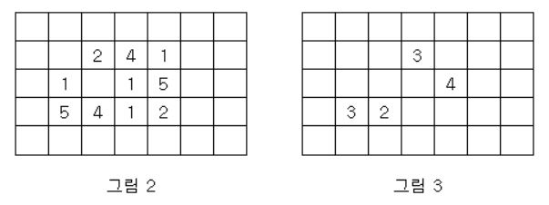
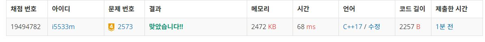

# 빙산

지구 온난화로 인하여 북극의 빙산이 녹고 있다. 빙산을 그림 1과 같이 2차원 배열에 표시한다고 하자. 빙산의 각 부분별 높이 정보는 배열의 각 칸에 양의 정수로 저장된다. 빙산 이외의 바다에 해당되는 칸에는 0이 저장된다. 그림 1에서 빈칸은 모두 0으로 채워져 있다고 생각한다.
<p align="center"> 

</p>

 그림 1. 행의 개수가 5이고 열의 개수가 7인 2차원 배열에 저장된 빙산의 높이 정보  

빙산의 높이는 바닷물에 많이 접해있는 부분에서 더 빨리 줄어들기 때문에, 배열에서 빙산의 각 부분에 해당되는 칸에 있는 높이는 일년마다 그 칸에 동서남북 네 방향으로 붙어있는 0이 저장된 칸의 개수만큼 줄어든다. 단, 각 칸에 저장된 높이는 0보다 더 줄어들지 않는다. 바닷물은 호수처럼 빙산에 둘러싸여 있을 수도 있다. 따라서 그림 1의 빙산은 일년후에 그림 2와 같이 변형된다.

<p align="center"> 

</p>


그림 3은 그림 1의 빙산이 2년 후에 변한 모습을 보여준다. 2차원 배열에서 동서남북 방향으로 붙어있는 칸들은 서로 연결되어 있다고 말한다. 따라서 그림 2의 빙산은 한 덩어리이지만, 그림 3의 빙산은 세 덩어리로 분리되어 있다.     
한 덩어리의 빙산이 주어질 때, 이 빙산이 두 덩어리 이상으로 분리되는 최초의 시간(년)을 구하는 프로그램을 작성하시오. 그림 1의 빙산에 대해서는 2가 답이다. 만일 전부 다 녹을 때까지 두 덩어리 이상으로 분리되지 않으면 프로그램은 0을 출력한다.    

**입력**  
첫 줄에는 이차원 배열의 행의 개수와 열의 개수를 나타내는 두 정수 N과 M이 한 개의 빈칸을 사이에 두고 주어진다. N과 M은 3 이상 300 이하이다. 그 다음 N개의 줄에는 각 줄마다 배열의 각 행을 나타내는 M개의 정수가 한 개의 빈 칸을 사이에 두고 주어진다. 각 칸에 들어가는 값은 0 이상 10 이하이다. 배열에서 빙산이 차지하는 칸의 개수, 즉, 1 이상의 정수가 들어가는 칸의 개수는 10,000 개 이하이다. 배열의 첫 번째 행과 열, 마지막 행과 열에는 항상 0으로 채워진다.      

**출력**  
첫 줄에 빙산이 분리되는 최초의 시간(년)을 출력한다. 만일 빙산이 다 녹을 때까지 분리되지 않으면 0을 출력한다.   

**Example1:**   
```
5 7
0 0 0 0 0 0 0
0 2 4 5 3 0 0
0 3 0 2 5 2 0
0 7 6 2 4 0 0
0 0 0 0 0 0 0

2
```

## trial1
### Intuition
```
BFS를 이용하여 모든 방향에 대해 탐색을 해야한다.
모든 빙산에 대해서 queue에 넣고 queue가 빌때까지 진행한다. (queue가 빈다는 것은 모든 빙산이 녹았다는 뜻이다.)
큐에서 앞에 front 값을 하나씩 뽑아낸 후에 그 값을 cur이라고 한다면 cur값 사방에 바다가 존재하는지 확인한다.(바다는 0 값이다)
바다가 사방에 존재하는 개수만큼 현재 빙산값에 빼준다.
만약에 빙산값이 0보다 작아서 녹게 된다면 zero라는 queue에 넣어준다. (zero라는 큐는 1년 후 녹을 빙산들을 arr에 업데이트를 해주기 위한 값들의 큐이다.)
큐에서 만약에 현재 시간이 1년이 지났다면 zero 큐를 이용하여 녹은 모든 빙산에 대해서 0으로 만들어주고 빙산이 하나에서 두개로 나뉘어 졌는지를 확인하는 함수 isseperated를 진행해준다. 
이때도 bfs를 사용하는데 현재 빙산 좌표에 대해서 인접한 모든 빙산을 방문하여 cnt를 세어준다. 
그리고 이 세어준 cnt 값이 앞으로 더 쪼개져야할 빙산들의 집합 q의 사이즈와 같다면 아직 하나의 빙산이 남아 있는 것이고 다르다면 쪼개진것으로 판단한다. 
```

### Codes  
```cpp
struct bing {
	int x, y;//좌표
	int hour=0;//시간(변수명은 hour이지만 1년을 뜻함)
	int bingnum = 0;//높이
};
int arr[301][301] = { 0, };
int xx[4] = { 0,-1,1,0 };
int yy[4] = { -1,0,0,1 };
queue<bing> q,zero;

bool isseperated(int size,bing cur) {
	vector<vector<bool>> visit(h, vector<bool>(w, false));
	queue<bing> q2;
	visit[cur.y][cur.x] = true;
	q2.push(cur);
	bing c,tmp;
	int cnt = 0;
	while (!q2.empty()) {
		cnt++;
		c = q2.front();
		q2.pop();
		for (int i = 0; i < 4; i++) {
			nx = c.x + xx[i];
			ny = c.y + yy[i];
			if (nx >= 0 && ny >= 0 && nx < w && ny < h) {//주변에 물이 있는지 확인
				if (!visit[ny][nx] && arr[ny][nx] > 0) {
					visit[ny][nx] = true;
					tmp.x = nx;
					tmp.y = ny;
					q2.push(tmp);
				}
			}
		}
	}
	return (size == cnt ? false : true);
}

int main() {

	cin >> h >> w;

	bing cur,tmp;
	for (int i = 0; i < h; i++) {
		for (int j = 0; j < w; j++) {
			cin>>arr[i][j];
			if (arr[i][j] > 0) {
				cur.x = j;
				cur.y = i;
				cur.bingnum = arr[i][j];
				q.push(cur);
			}
		}
	}
	int minus = 0, curhour=0;
	if (q.size() == (h*w)) { cout << 0; return 0; }
	while (!q.empty()) {
		cur = q.front();
		minus = 0;
		if (curhour < cur.hour) {
			bing t;
			while (!zero.empty()) {
				t = zero.front();
				arr[t.y][t.x] = 0;
				zero.pop();
			}
			//여기서 땅이 갈라졌는지 확인
			if (isseperated(q.size(),cur)) { 
				cout << cur.hour;
				return 0;
			}
			curhour = cur.hour;
		}
		q.pop();
		for (int i = 0; i < 4; i++) {
			nx = cur.x + xx[i];
			ny = cur.y + yy[i];
			if (nx >= 0 && ny >= 0 && nx < w && ny < h && arr[ny][nx]==0) {//주변에 물이 있는지 확인
				minus++;
			}
		}
		cur.hour++;
		cur.bingnum = cur.bingnum - minus;
		if (cur.bingnum > 0) {//빙산이 다 녹아버리면 없애버린다.
			q.push(cur);
			arr[cur.y][cur.x] = cur.bingnum;
		}
		else {//빙산이 0이 된애들은 zero에 넣는다.
			zero.push(cur);
		}

	}
	cout << 0;
	return 0;

}
```
### Results (Performance)  
**Runtime:**  68 ms 
**Memory Usage:** 	2472 MB  


<p align="center"> 

</p>


### 문제 URL (백준)  
https://www.acmicpc.net/problem/2573