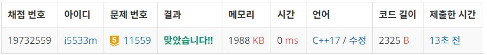

# 뿌요뿌요

뿌요뿌요의 룰은 다음과 같다.

필드에 여러 가지 색깔의 뿌요를 놓는다. 뿌요는 중력의 영향을 받아 아래에 바닥이나 다른 뿌요가 나올 때까지 아래로 떨어진다.  

뿌요를 놓고 난 후, 같은 색 뿌요가 4개 이상 상하좌우로 연결되어 있으면 연결된 같은 색 뿌요들이 한꺼번에 없어진다.  

뿌요들이 없어지고 나서 위에 다른 뿌요들이 있다면, 역시 중력의 영향을 받아 차례대로 아래로 떨어지게 된다.  

아래로 떨어지고 나서 다시 같은 색의 뿌요들이 4개 이상 모이게 되면 또 터지게 되는데, 터진 후 뿌요들이 내려오고 다시 터짐을 반복할 때마다 1연쇄씩 늘어난다.  

터질 수 있는 뿌요가 여러 그룹이 있다면 동시에 터져야 하고 여러 그룹이 터지더라도 한번의 연쇄가 추가된다.  

남규는 최근 뿌요뿌요 게임에 푹 빠졌다. 이 게임은 1:1로 붙는 대전게임이라 잘 쌓는 것도 중요하지만, 상대방이 터뜨린다면 연쇄가 몇 번이 될지 바로 파악할 수 있는 능력도 필요하다. 하지만 아직 실력이 부족하여 남규는 자기 필드에만 신경 쓰기 바쁘다.   상대방의 필드가 주어졌을 때, 연쇄가 몇 번 연속으로 일어날지 계산하여 남규를 도와주자!  

**입력**  
12x6의 문자가 주어진다.

이때 .은 빈공간이고 .이 아닌것은 각각의 색깔의 뿌요를 나타낸다.  

R은 빨강, G는 초록, B는 파랑, P는 보라, Y는 노랑이다.(모두 대문자로 주어진다.)  

입력으로 주어지는 필드는 뿌요들이 전부 아래로 떨어진 뒤의 상태(즉 뿌요 아래에 빈 칸이 있는 경우는 없음) 이다.      

**출력**  
현재 주어진 상황에서 몇연쇄가 되는지 출력하라. (하나도 터지지 않는다면 0을 출력하면 된다.)  


**Example1:**   
```
......
......
......
......
......
......
......
......
.Y....
.YG...
RRYG..
RRYGG.


3
```

## trial1
### Intuition
```
bfs를 여러번 사용하여 해결하였다.
전체 게임판을 확인하는 함수 checkall,
함수들은 부셔질 뿌요가 있는지 없는지 확인해서 존재하면 pop 해주는 함수 findpop
그리고 중력으로 인해 아래로 모두 움직이는 함수 move 로 이루어져 있다.
pu라는 구조체는 뿌요의 좌표와 색을 저장하기 위한 구조체이다.
우선 checkall 함수에서는 밑의 좌표부터 알파벳이 존재하고 visit로 이미 방문하지 않은 좌표라면 findpop 함수를 이용해
그 좌표에 존재하는 뿌요에서 연결된 모든 뿌요에 대해서 넓이를 확인하여 4이상인 경우 없애주도록 구성하였다. 
그리고 이작업이 모든 뿌요에 대해서 완료됐다면 move 함수를 이용해서 중력으로 움직여야 하는 뿌요에 대해서 밑으로 움직인다. 
이때 주의 해야할 점은 checkall에서 밑에 있는 뿌요부터 진행을 해야 move 함수를 호출해서 중력으로 밑에 존재하는 
뿌요부터 밑으로 이동이 가능하게 된다.
```

### Codes  
```cpp
struct pu {
	int x, y;
	char c;
};
int xx[4] = { 0,0,1,-1 };
int yy[4] = { 1,-1,0,0 };
char grid[12][6];
vector<vector<bool>> visit(12, vector<bool>(6, false));
int cnt = 0;
queue<pu> q;
void move(queue<pu> mv) {
	pu cur;
	int nx, ny;
	while (!mv.empty()) {
		cur = mv.front();
		mv.pop();
		if (grid[cur.y][cur.x] != '.') {//.이 아니면 밑에 있는지 확인해서 내린다.
				nx = cur.x + xx[0];
				ny = cur.y + yy[0];
				if (nx >= 0 && ny >= 0 && nx < 6 && ny < 12) {//범위 안이면
					if (grid[ny][nx]=='.') {//.이면 밑으로 내려간다.
						grid[ny][nx] = cur.c;
						grid[cur.y][cur.x] = '.';
						cur.y = ny;
						cur.x = nx;
						mv.push(cur);
					}
				}
		}
	}
}
bool findpop(vector<vector<bool>>& visit) {
	pu cur;
	int nx, ny,pucnt=0;
	queue<pu> yo;
	visit[q.front().y][q.front().x] = true;
	while (!q.empty()) {
		pucnt++;//크기를 잰다.
		cur = q.front();
		yo.push(cur);
		q.pop();
		for (int i = 0; i < 4; i++) {
			nx = cur.x + xx[i];
			ny = cur.y + yy[i];
			if (nx >= 0 && ny >= 0 && nx < 6 && ny < 12) {
				if (!visit[ny][nx] && grid[ny][nx]==cur.c) {//이미 들른곳이 아니고 같은 컬러면 q에 넣기
					visit[ny][nx] = true;
					pu nw;
					nw.c = cur.c;
					nw.x = nx;
					nw.y = ny;
					q.push(nw);
				}
			}
		}
	}
	if (pucnt >= 4) {
		while (!yo.empty()) {
			cur = yo.front();
			grid[cur.y][cur.x] = '.';//grid 바꿔주기
			yo.pop();
		}
		return true;
	}
	return false;
}
bool checkall(vector<vector<bool>> visit) {
	bool f=false;
	queue<pu> mv;
	for (int i = 11; i >= 0; i--) {
		for (int j = 0; j < 6; j++) {
			if (grid[i][j] != '.') {
				pu p;
				p.x = j;
				p.y = i;
				p.c = grid[i][j];
				mv.push(p);//밑에서부터 차례대로 queue에 넣는다.
				if (!visit[i][j]) {
					q.push(p);
					bool t = findpop(visit);//모든 애들에 대해서 pop해줘야함
					f = (f ? true : t);
				}
			}
		}
	}
	move(mv);
	return f;
}
int main() {
	//freopen("test.txt", "r", stdin);
	for (int i = 0; i < 12; i++) {
		for (int j = 0; j < 6; j++) {
			cin>>grid[i][j];
		}
	}
	bool f = false;
	while (1) {
		f = checkall(visit);
		if (!f) {
			cout << cnt;
			return 0;
		}
		cnt++;//연쇄 증가
		f = false;
	}
	return 0;

}
```

### Results (Performance)    
**Runtime:**  0 ms   
**Memory Usage:** 	1988 kB    


<p align="center"> 

</p>


### 문제 URL (백준)  
https://www.acmicpc.net/problem/11559