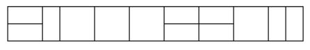
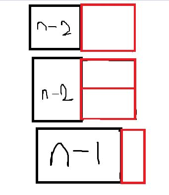

# 2×n 타일링 2

문제
2×n 직사각형을 1×2, 2×1과 2×2 타일로 채우는 방법의 수를 구하는 프로그램을 작성하시오.

아래 그림은 2×17 직사각형을 채운 한가지 예이다.

<p align="center"> 

</p>

입력
첫째 줄에 n이 주어진다. (1 ≤ n ≤ 1,000)

출력
첫째 줄에 2×n 크기의 직사각형을 채우는 방법의 수를 10,007로 나눈 나머지를 출력한다.

**Example1:**   
```
12

2731
```

**Example1:**   
```
8

171
```

## trial1
### Intuition
```
Pic2와 같이 세가지의 모양이 각각 n-2의 경우의수, n-1의 경우의수의 조합으로 현재 n의 값의 경우의수를 구할 수
있다는 것을 보여주고 있다.
그러므로 점화식을 n=2(n-2)+(n-1) 이 되는 것을 확인 할 수 있다.
```
<p align="center"> 

</p>

### Codes  
```cpp
int main() {
	ios::sync_with_stdio(0);
	cin.tie(NULL);
	vector<int> dp;
	dp.push_back(0);
	dp.push_back(1);
	dp.push_back(3);
	int n;
	cin >> n;
	for (int i = 3; i <= n; i++) {
		dp.push_back((dp[i - 1] + (2 * dp[i - 2]))%10007);
	}
	cout << dp[n];
	return 0;
}
```

### Results (Performance)    
**Runtime:**  0 ms   
**Memory Usage:** 	1984 kB    


<p align="center"> 

</p>


### 문제 URL (백준)  
https://www.acmicpc.net/problem/11727