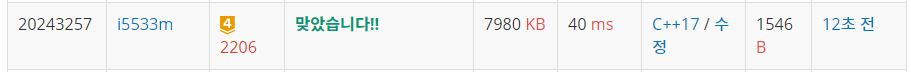

# 카드구매하기

N×M의 행렬로 표현되는 맵이 있다. 맵에서 0은 이동할 수 있는 곳을 나타내고, 1은 이동할 수 없는 벽이 있는 곳을 나타낸다. 당신은 (1, 1)에서 (N, M)의 위치까지 이동하려 하는데, 이때 최단 경로로 이동하려 한다. 최단경로는 맵에서 가장 적은 개수의 칸을 지나는 경로를 말하는데, 이때 시작하는 칸과 끝나는 칸도 포함해서 센다.

만약에 이동하는 도중에 한 개의 벽을 부수고 이동하는 것이 좀 더 경로가 짧아진다면, 벽을 한 개 까지 부수고 이동하여도 된다.

맵이 주어졌을 때, 최단 경로를 구해 내는 프로그램을 작성하시오.

입력
첫째 줄에 N(1 ≤ N ≤ 1,000), M(1 ≤ M ≤ 1,000)이 주어진다. 다음 N개의 줄에 M개의 숫자로 맵이 주어진다. (1, 1)과 (N, M)은 항상 0이라고 가정하자.

출력
첫째 줄에 최단 거리를 출력한다. 불가능할 때는 -1을 출력한다.

**Example1:**   
```
6 4
0100
1110
1000
0000
0111
0000

15
```

**Example1:**   
```
4 4
0111
1111
1111
1110

-1
```

## trial1
### Intuition
```
첫번째 trial에서는 visit를 2차원으로 선언한 상태에서 진행하였다.
BFS를 이용해서 해결해야하는 문제였는데 벽을 부시기 전과 부셨을때의 visit를 같이 사용하여 문제를 수행하였다.
벽을 만나게 된다면 현재 land 변수가 벽을 이미 한번 부신상태인지 아닌지 판단하여 이미 부신상태라면 
벽을 넘을 수 없고 아직 부시지 않은 상태라면 벽을 넘을 수 있다. (queue에 넣어준다는 뜻)
그리고 0이고 다음 방문하려는 장소의 cost가 현재 cost보다 큰 경우에 혹은 0인 경우에 방문이 가능하다. (queue에 넣어준다는 뜻)
이때는 결괏값이 제대로 나오기는 하지만 시간초과가 나게 된다.
그 이유는 아무래도 벽을 뚫고왔을때와 벽을 뚫지 않았을때를 판단하지 않고 진행하다보니 불필요한 land를 방문했기
때문이라고 생각한다.
```

### Codes  
```cpp
int N, M;
int m[1001][1001] = { 0, };
struct land {
	int x, y;
	int c=1;
	int wallcnt = 0;
};
int xx[4] = { 0,0,1,-1 };
int yy[4] = { 1,-1,0,0 };
int small;
void bfs() {
	vector<vector<int>> visit(N,vector<int>(M,0));
	queue<land> q;
	land cur;
	visit[0][0] = true;
	cur.x = 0;
	cur.y = 0;
	int nx, ny;
	q.push(cur);
	while (!q.empty()) {
		cur = q.front();
		q.pop();
		if (cur.y == N - 1 && cur.x == M - 1) {//끝에 도달한 경우
			small=min(cur.c,small);
		}
		for (int i = 0; i < 4; i++) {
			nx = cur.x + xx[i];
			ny = cur.y + yy[i];
			if (nx >= 0 && ny >= 0 && nx < M && ny < N) {
				land nw;
				nw.wallcnt = cur.wallcnt;
				nw.x = nx;
				nw.y = ny;
				nw.c = cur.c + 1;
				if (m[ny][nx] == 1) {//벽이라면
					if (cur.wallcnt == 0) {//벽을 부실수 있는경우라면
						nw.wallcnt++;
					}
					else continue;//벽을 이미 한번 이상 뚫었다면
				}
				if (visit[ny][nx] >= nw.c || visit[ny][nx] == 0) {//cost가 더 작은경우에만 방문
					visit[ny][nx] = nw.c;
					q.push(nw);
				}
			}
		}
	}
}
```

## trial2
### Intuition
```
시간초과 문제를 없애기 위해서 이번에는 visit를 3차원 배열로 선언해서 벽을 부쉈을 때와 부수기 전상태에 대한 visit를 선언하였다.
위의 방법과 거의 비슷하지만 현재 land가 벽을 뚫고 온 변수인건지 아닌지를 판단하여 visit에 상태를 표시하였다.
벽을 뚫고오던 뚫고오지 않던 이미 방문한 자리라면 다시 방문하지 않도록 하였고 가장 먼저 N-1 M-1 좌표의 자리에 
먼저 도착하게 되는 것이 가장 최소로 마지막 자리에 방문하는 상황으로 판단한다. 
```

### Codes  
```cpp
int m[1000][1000] = { 0, };
bool visit[1000][1000][2];
struct land {
	int x, y;
	int c=1;
	int wallcnt = 0;
};
int xx[4] = { 0,0,1,-1 };
int yy[4] = { 1,-1,0,0 };
int small;
void bfs() {
	//int visit[10][10] = { 0, };
	queue<land> q;
	land cur;
	visit[0][0][0] = true;
	cur.x = 0;
	cur.y = 0;
	int nx, ny;
	q.push(cur);
	while (!q.empty()) {
		cur = q.front();
		q.pop();
		if (cur.y == N - 1 && cur.x == M - 1) {//끝에 도달한 경우
			small = cur.c;
			return;
		}
		for (int i = 0; i < 4; i++) {
			nx = cur.x + xx[i];
			ny = cur.y + yy[i];
			if (nx >= 0 && ny >= 0 && nx < M && ny < N) {
				land nw;
				nw.wallcnt = cur.wallcnt;
				if (m[ny][nx] == 1) {//벽이라면
					if (cur.wallcnt == 0) {//벽을 부실수 있는경우라면
						nw.wallcnt++;
					}
					else continue;//벽을 이미 한번 이상 뚫었다면
				}
				if (!visit[ny][nx][nw.wallcnt]) {//visit 하지 않은경우에만
					visit[ny][nx][nw.wallcnt] = true;
					nw.x = nx;
					nw.y = ny;
					nw.c = cur.c + 1;
					q.push(nw);
				}
			}
		}
	}
}
```

### Results (Performance)    
**Runtime:**  40 ms   
**Memory Usage:** 	7980 kB    


<p align="center"> 

</p>


### 문제 URL (백준)  
https://www.acmicpc.net/problem/2206