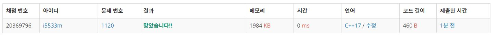

# 문자열
길이가 N으로 같은 문자열 X와 Y가 있을 때, 두 문자열 X와 Y의 차이는 X[i] ≠ Y[i]인 i의 개수이다. 예를 들어, X=”jimin”, Y=”minji”이면, 둘의 차이는 4이다.

두 문자열 A와 B가 주어진다. 이때, A의 길이는 B의 길이보다 작거나 같다. 이제 A의 길이가 B의 길이와 같아질 때 까지 다음과 같은 연산을 할 수 있다.

A의 앞에 아무 알파벳이나 추가한다.
A의 뒤에 아무 알파벳이나 추가한다.
이때, A와 B의 길이가 같으면서, A와 B의 차이를 최소로 하는 프로그램을 작성하시오.

**Example1:**   
```
adaabc aababbc

2
```

**Example2:**   
```
jimae
najimjima

2
```

## trial1
### Intuition
```
A문자열이 B 문자열에 어떤 인덱스부터 가장 비슷한지를 찾으면 된다.

그렇기 때문에 0부터 B문자열에서 A문자열의 차이만큼까지 반복문을 돌려서 B문자열의 인덱스 0부터 차이만큼까지 A와 문자열의
같은 정도를 비교하여 cnt를 세어주었다.
```

### Codes  
```cpp
int main() {
	//freopen("문자열.txt", "r", stdin);
	string a, b;
	cin >> a;
	cin >> b;
	int cnt = 0;
	int mcnt = 0;
	int dif = b.size() - a.size();
	for (int i = 0; i <= dif; i++) {
		cnt = 0;
		for (int j = 0; j < a.size(); j++) {
			if (a[j] == b[i+j]) {//같다면
				cnt++;
			}
		}
		mcnt = max(mcnt, cnt);
	}
	cout << b.size()-mcnt-dif;
}
```

## trial1
### Intuition
```
위의 예제가 제대로 안되었기 때문에 새로운 방법을 생각하였다.
반으로 나눈값까지 반복문을 돌려주어서 그중 가장 큰 패키지의 조합이
나오면 그 값으로 업데이트 해주는 방법이다.
trial 1에서는 너무 퍼포먼스만 생각하고 풀어서 예외처리를 못한것같다.
```

### Codes  
```cpp
int main() {
	//freopen("카드구매하기.txt", "r", stdin);
	cin >> N;
	vector<int> card;
	vector<int> dp;
	int tmp = 0;
	card.push_back(0);
	dp.push_back(0);
	cin >> tmp;
	card.push_back(tmp);
	dp.push_back(tmp);
	int j = 0;
	for (int i = 2; i <= N; i++) {
		cin >> tmp;
		card.push_back(tmp);
		dp.push_back(tmp);
		j = 1;
		while (j <= (i / 2)) {
			dp[i] = max(dp[i],dp[i - j]+dp[j]);
			j++;
		}
	}
	cout << dp[N];
	return 0;
}
```

### Results (Performance)    
**Runtime:**  0 ms   
**Memory Usage:** 	1984 kB    


<p align="center"> 

</p>


### 문제 URL (백준)  
https://www.acmicpc.net/problem/1120