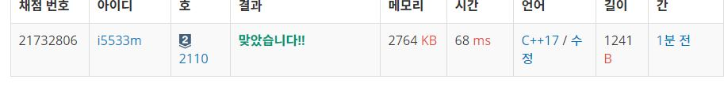

# 공유기 설치
도현이의 집 N개가 수직선 위에 있다. 각각의 집의 좌표는 x1, ..., xN이고, 집 여러개가 같은 좌표를 가지는 일은 없다.

도현이는 언제 어디서나 와이파이를 즐기기 위해서 집에 공유기 C개를 설치하려고 한다. 최대한 많은 곳에서 와이파이를 사용하려고 하기 때문에, 한 집에는 공유기를 하나만 설치할 수 있고, 가장 인접한 두 공유기 사이의 거리를 가능한 크게 하여 설치하려고 한다.

C개의 공유기를 N개의 집에 적당히 설치해서, 가장 인접한 두 공유기 사이의 거리를 최대로 하는 프로그램을 작성하시오.

공유기를 1, 4, 8 또는 1, 4, 9에 설치하면 가장 인접한 두 공유기 사이의 거리는 3이고, 이 거리보다 크게 공유기를 3개 설치할 수 없다.

## Example1

```
Input: 
5 3
1
2
8
4
9

Output: 
3
```

## trial1
### Intuition
```
이진탐색을 사용하여 문제를 해결하였다.
여기서 이진탐색을 해야하는 값은 바로 최장길이이다.
그러므로 최단길이를 lt로 두고 최장길이를 rt로 둔다.
이렇게 햇을때 모든 집들 사이의 길이가 md로 지정해준 공유기 사이의 거리보다 작은경우
공유기를 설치할수 있는 것이므로 cnt를 1씩 더해준다.
마지막에는 cnt값이 C보다 작은경우 md(최장길이 후보)가 너무 길어서 공유기를 모두 설치할 수 없는경우인것이고
C보다 cnt가 크거나 같은경우에는 최장길이가 될수 있는 가능성을 보여주고 있다.
하지만 이중 가장 큰것을 구해야 하므로 lt와 rt가 같을때까지 반복해주면 가장 적합한 최장길이가 나온다.
```
### Codes  
```cpp
int main() {
    int N, C;
    //freopen("공유기설치.txt", "r", stdin);
    cin >> N >> C;//N은 집의 수 C는 공유기 개수
    vector<int> v;
    for (int i = 0; i < N; i++) {
        int tmp;
        cin >> tmp;
        v.push_back(tmp);
    }
    sort(v.begin(), v.end());
    int lt = 1;
    int rt = v[v.size() - 1]-v[0];//가장 최장길이
    int md = 0;
    int longest = rt;
    while (lt < rt) {//길이가 하나로 수렴할때까지
        md = (rt + lt) / 2;//중간 길이값으로 먼저 설정하기
        int cnt = 1;//공유기 개수
        int st = v[0];
        for (int i = 0; i < v.size(); i++) {
            if ((v[i] - st) >= md) {//st는 이전에 공유기가 설치된곳의 좌표이고 현재좌표와의 차가 md의 길이보다 작거나 같은경우 cnt++
                cnt++;
                st = v[i];//이전 공유기가 설치된곳은 st로 초기화
            }
        }
        if (cnt < C) {//md값이 너무 커서 공유기를 전부 설치가 불가능한경우 md는 더 줄여야한다.
            rt = md;
        }
        else {//md는 더 커질수 있는 경우 하지만 현재까지 될수 있는 최장길이로 저장한다.
            lt = md+1;
            longest = md;
        }
    }
    cout << longest << endl;

    return 0;
}
```

### Results (Performance)  
**Runtime:**  68 ms 
**Memory Usage:** 	2764 kb 

<p align="center"> 

</p>


### 문제 URL (백준)  
https://www.acmicpc.net/problem/2110