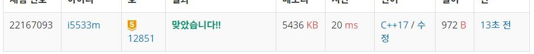

# 숨바꼭질2

수빈이는 동생과 숨바꼭질을 하고 있다. 수빈이는 현재 점 N(0 ≤ N ≤ 100,000)에 있고, 동생은 점 K(0 ≤ K ≤ 100,000)에 있다. 수빈이는 걷거나 순간이동을 할 수 있다. 만약, 수빈이의 위치가 X일 때 걷는다면 1초 후에 X-1 또는 X+1로 이동하게 된다. 순간이동을 하는 경우에는 1초 후에 2xX의 위치로 이동하게 된다.

수빈이와 동생의 위치가 주어졌을 때, 수빈이가 동생을 찾을 수 있는 가장 빠른 시간이 몇 초 후인지 그리고, 가장 빠른 시간으로 찾는 방법이 몇 가지 인지 구하는 프로그램을 작성하시오.

입력
첫 번째 줄에 수빈이가 있는 위치 N과 동생이 있는 위치 K가 주어진다. N과 K는 정수이다.

출력
첫째 줄에 수빈이가 동생을 찾는 가장 빠른 시간을 출력한다.

둘째 줄에는 가장 빠른 시간으로 수빈이가 동생을 찾는 방법의 수를 출력한다.


## Example1

```
Input: 
5 17

Output: 
4
2
```

## Example2

```
Input: 
1 4

Output: 
2
2
```

## trial1
### Intuition
```
밑의 BFS는 제대로 결과를 가져오지 못한다. 그 이유는
input이 1 4인경우
1-> 2(1+1)->4
1-> 2(1*2)->4
이경우 두가지가 존재하는데 visit를 queue에 넣기 전에 표시해주기 때문에 중간 과정에서 2로 만드는 경우의 수를
세어주지 못하기 때문이다. 
```
### Codes  
```cpp
int main() {
    freopen("숨바꼭질2.txt", "r", stdin);
    int N, K;
    cin >> N >> K;
    int xx[3] = { -1,1,2 };
    queue<block> q;
    block b;
    b.x = N;
    b.time = 0;
    q.push(b);
    block cur;
    visit[N] = 0;
    int cnt = 1;
    int minK = MAX;
    while (!q.empty()) {
        cur = q.front();
        q.pop();
        for (int i = 0; i < 3; i++) {
            int nx= xx[i] + cur.x;
            if (i == 2) nx = xx[i] * cur.x;
            int nxtime = cur.time + 1;
            if (nx >= 0 && nx <= MAX) {//다음 인덱스가 범위 안에 있는 경우
                if (nx == K) {//인덱스가 마지막에 도달햇을경우
                    if (minK == nxtime) {//시간이 현재 minimum 시간과 같은경우
                        cnt++;
                    }
                    else if (minK > nxtime) {//더 작은경우 다시 초기화
                        cnt = 1;
                        minK = nxtime;
                    }
                }
                if (!visit[nx]) {//방문하지 않은경우 q에 넣기
                    visit[nx] = true;
                    block nw;
                    nw.x = nx;
                    nw.time = nxtime;
                    q.push(nw);
                }
            }
        }
    }
    cout << minK << endl << cnt << endl;
    return 0;
}
```

## trial2
### Intuition
```
이문제에서는 BFS의 구조가 평소의 BFS의 구조와 조금 다르다.
보통 경로를 탐색할때 visit를 표시해주는데 이문제에서는 visit는 queue에 경로를 이미 넣은 후에 
queue에서 빼올때 visit을 표시하고 마지막 K경로에 도착햇는지 확인하는 방식이다. 
```
### Codes  
```cpp
int main() {
    freopen("숨바꼭질2.txt", "r", stdin);
    int N, K;
    cin >> N >> K;
    int xx[3] = { -1,1,2 };
    queue<block> q;
    block cur;
    cur.x = N;
    cur.time = 0;
    q.push(cur);
    visit[N] = true;
    int cnt = 1;
    int minK = MAX;
    while (!q.empty()) {
        cur = q.front();
        q.pop();
        visit[cur.x] = true;
        if (cur.x == K) {
            if (minK > cur.time) {
                cnt = 1;
                minK = cur.time;
            }
            else if (minK == cur.time) {
                cnt++;
            }
        }

        for (int i = 0; i < 3; i++) {
            int nx= xx[i] + cur.x;
            if (i == 2) nx = xx[i] * cur.x;
            if (nx >= 0 && nx <= MAX && !visit[nx]) {//다음 인덱스가 범위 안에 있는 경우
                block nw;
                nw.x = nx;
                nw.time = cur.time + 1;
                q.push(nw);
            }
        }
    }
    cout << minK << endl << cnt << endl;
    return 0;
}
```
### Results (Performance)  
**Runtime:** 20 ms   
**Memory Usage:**   5436 kb    

<p align="center"> 

</p>


### 문제 URL (백준)  
https://www.acmicpc.net/problem/12851