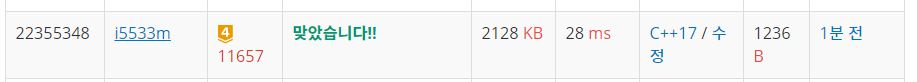

# 타임머신

N개의 도시가 있다. 그리고 한 도시에서 출발하여 다른 도시에 도착하는 버스가 M개 있다. 각 버스는 A, B, C로 나타낼 수 있는데, A는 시작도시, B는 도착도시, C는 버스를 타고 이동하는데 걸리는 시간이다. 시간 C가 양수가 아닌 경우가 있다. C = 0인 경우는 순간 이동을 하는 경우, C < 0인 경우는 타임머신으로 시간을 되돌아가는 경우이다.

1번 도시에서 출발해서 나머지 도시로 가는 가장 빠른 시간을 구하는 프로그램을 작성하시오.

입력
첫째 줄에 도시의 개수 N (1 ≤ N ≤ 500), 버스 노선의 개수 M (1 ≤ M ≤ 6,000)이 주어진다. 둘째 줄부터 M개의 줄에는 버스 노선의 정보 A, B, C (1 ≤ A, B ≤ N, -10,000 ≤ C ≤ 10,000)가 주어진다. 

출력
만약 1번 도시에서 출발해 어떤 도시로 가는 과정에서 시간을 무한히 오래 전으로 되돌릴 수 있다면 첫째 줄에 -1을 출력한다. 그렇지 않다면 N-1개 줄에 걸쳐 각 줄에 1번 도시에서 출발해 2번 도시, 3번 도시, ..., N번 도시로 가는 가장 빠른 시간을 순서대로 출력한다. 만약 해당 도시로 가는 경로가 없다면 대신 -1을 출력한다.


## Example1

```
Input: 
3 4
1 2 4
1 3 3
2 3 -1
3 1 -2

Output: 
4
3
```

## Example2

```
Input: 
3 4
1 2 4
1 3 3
2 3 -4
3 1 -2

Output: 
-1
```

## trial1
### Intuition
```
이 문제는 negative cycle이 존재하는지 여부를 알아야 하기 때문에 벨만 포드를 사용하여 문제를 해결하였다.
모든 연결 간선들을 탐색해주면서 1번 도시와 연결되는지에 대한 여부와 더 짧은 연결 간선이
존재하는지를 확인하기만 하면 되는 문제였다.
그래서 나는 v 배열을 선언하여 도시의 개수만큼 INF로 초기화 시켜둔다. 
이 배열이 1번 도시와 연결하는 가장 짧은 경로의 크기를 기록하는 배열이다.
1번만 INF가 아니도록 초기화 하고 벨만포드 알고리즘의 흐름에 따라
N만큼 모든 연결 간선에 대해서 방문하여 연결할지 말지 결정한다.
N만큼 반복한 후에 한번더 모든 간선에 대해서 방문을 하여 간선들의 변화가 생기는지 확인하고
변화가 생긴다면 negative cycle이 존재하는 것이므로 -1을 출력하고 변화가 생기지 않는다면
negative cycle이 존재하지 않는다는 뜻이다. 그러면 각 node들에 대해서 짧은 경로를 출력하면 된다.
여기서 주의해야할 것은 간선들에 대해서 long long 타입으로 선언해주어야 한다는 것이다.
도시가 500이고 간선이 60000개인경우 그리고 가중치가 -10000인경우 int와 long의 범위를 훨신
넘을수 있기 때문이다.
```
### Codes  
```cpp
int main() {
    freopen("타임머신.txt", "r", stdin);
    int N, M;
    cin >> N >> M;
    long long v[501] = { 0, };//
    for (int i = 2; i <= N; i++) {
        v[i] = INF;//최대거리로 초기화
    }
    vector<long long> A(M,0),B(M,0), C(M,0);
    for (int i = 0; i < M; i++) {//연결해주기
        long long a, b, c;
        cin >> a >> b >> c;
        A[i]=a;
        B[i]=b;
        C[i]=c;
    }
    for (int i = 0; i < N;i++) {//Nq번 반복
        for (int j = 0; j < M; j++) {
            if (v[A[j]] != INF) {//INF가 아니면 연결해줄지 고민하기
                long long cur = v[A[j]] + C[j];//연결했을때의 time
                if (cur < v[B[j]])//더 작으면 업데이트
                {
                    v[B[j]] = cur;
                }
            }
        }
    }
    bool cycle = false;
    for (int j = 0; j < M; j++) {//사이클 확인
        if (v[A[j]] != INF) {//INF가 아니면 연결해줄지 고민하기
            long long cur = v[A[j]] + C[j];//연결했을때의 time
            if (cur < v[B[j]])//더 작으면 이건 무한대 과거로감
            {
                cycle = true;
                break;
            }
        }
    }
    if (!cycle) {
        for (int i = 2; i <= N; i++) {
            cout << (v[i]== INF?-1:v[i]) << endl;
        }
    }
    else {
        cout << -1 << endl;
    }
    return 0;
}
```

### Results (Performance)  
**Runtime:** 28 ms   
**Memory Usage:**   2128 kb    

<p align="center"> 

</p>


### 문제 URL (백준)  
https://www.acmicpc.net/problem/11657