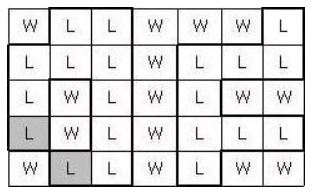

# 보물섬

보물섬 지도를 발견한 후크 선장은 보물을 찾아나섰다.   
보물섬 지도는 아래 그림과 같이 직사각형 모양이며 여러 칸으로 나뉘어져 있다. 각 칸은 육지(L)나 바다(W)로 표시되어 있다.  
이 지도에서 이동은 상하좌우로 이웃한 육지로만 가능하며, 한 칸 이동하는데 한 시간이 걸린다.   
보물은 서로 간에 최단 거리로 이동하는데 있어 가장 긴 시간이 걸리는 육지 두 곳에 나뉘어 묻혀있다.   
육지를 나타내는 두 곳 사이를 최단 거리로 이동하려면 같은 곳을 두 번 이상 지나가거나, 멀리 돌아가서는 안 된다.   

<p align="center"> 

</p>

예를 들어 위와 같이 지도가 주어졌다면 보물은 아래 표시된 두 곳에 묻혀 있게 되고, 이 둘 사이의 최단 거리로 이동하는 시간은 8시간이 된다.    

<p align="center"> 

</p>

보물 지도가 주어질 때, 보물이 묻혀 있는 두 곳 간의 최단 거리로 이동하는 시간을 구하는 프로그램을 작성하시오.   

**입력**  
첫째 줄에는 보물 지도의 세로의 크기와 가로의 크기가 빈칸을 사이에 두고 주어진다.   
이어 L과 W로 표시된 보물 지도가 아래의 예와 같이 주어지며, 각 문자 사이에는 빈 칸이 없다. 보물 지도의 가로, 세로의 크기는 각각 50이하이다.       

**출력**  
첫째 줄에 보물이 묻혀 있는 두 곳 사이를 최단 거리로 이동하는 시간을 출력한다.   

**Example1:**   
```
5 7
WLLWWWL
LLLWLLL
LWLWLWW
LWLWLLL
WLLWLWW

8
```

## trial1
### Intuition
```
BFS를 이용하여 모든 방향에 대해 탐색을 해야한다.  
bfs는 한 Land에서 주변에 갈수 있는 모든 Land에 대한 최단 거리를 구하는 것이므로 모든 Land에 대해서 bfs를 돌려서
각 Land에 대한 최단거리들을 구해준다.
그중에서 보물이 있는 곳은 bfs를 돌려서 나온 가장 큰값이 보물이 숨겨진 위치라고 할 수 있다. 
```


### Codes  
```cpp
int w, h,nx,ny;
char arr[51][51] = { 0, };
static int xx[4] = { 0,0,1,-1 };
static int yy[4] = { 1,-1,0,0 };
struct land {
	int x, y;
	int len=0;
};
int mx = 0;
queue<land> q;
int findtr(land cur,vector<vector<bool>> visit) {
	queue<land> qq;
	qq.push(cur);
	int localmx = 0;
	visit[cur.y][cur.x] = true;
	land nxl;
	while (!qq.empty()) {
		cur = qq.front();
		qq.pop();
		if (cur.len > localmx) localmx = cur.len;//지금까지의 최대수를 넣기
		for (int i = 0; i < 4; i++) {
			nx = cur.x + xx[i];
			ny = cur.y + yy[i];
			if (nx >= 0 && ny >= 0 && nx < w && ny < h) {//범위 안이라면
				if (!visit[ny][nx] && arr[ny][nx]=='L') {//아직 들르지 않은 땅이라면 q에 넣기
					visit[ny][nx] = true;
					nxl.x = nx;
					nxl.y = ny;
					nxl.len = cur.len+1;
					qq.push(nxl);
				}
			}
		}
	}
	return localmx;
}
int main() {
	//freopen("test.txt", "r",stdin);
	cin >> h >> w;
	land l;
	int localmx = 0;
	for (int i = 0; i < h; i++) {
		for (int j = 0; j < w; j++) {
			cin >> arr[i][j];
			if (arr[i][j] == 'L') {
				l.x = j;
				l.y = i;
				q.push(l);
			}
		}
	}
	vector<vector<bool>> visit(h, vector<bool>(w, 0));
	while (!q.empty()) {
		l = q.front();
		q.pop();
		localmx=findtr(l,visit);
		if (localmx > mx) mx = localmx;//최소 거리중 가장 먼거리라면?
	}
	cout << mx;

	return 0;
}
```

### Results (Performance)    
**Runtime:**  124 ms   
**Memory Usage:** 	1992 MB    


<p align="center"> 

</p>


### 문제 URL (백준)  
https://www.acmicpc.net/problem/2589