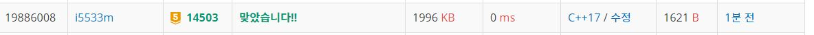

# 로봇청소기

로봇 청소기가 주어졌을 때, 청소하는 영역의 개수를 구하는 프로그램을 작성하시오.

로봇 청소기가 있는 장소는 N×M 크기의 직사각형으로 나타낼 수 있으며, 1×1크기의 정사각형 칸으로 나누어져 있다. 각각의 칸은 벽 또는 빈 칸이다. 청소기는 바라보는 방향이 있으며, 이 방향은 동, 서, 남, 북중 하나이다. 지도의 각 칸은 (r, c)로 나타낼 수 있고, r은 북쪽으로부터 떨어진 칸의 개수, c는 서쪽으로 부터 떨어진 칸의 개수이다.

로봇 청소기는 다음과 같이 작동한다.

현재 위치를 청소한다.
현재 위치에서 현재 방향을 기준으로 왼쪽방향부터 차례대로 탐색을 진행한다.
왼쪽 방향에 아직 청소하지 않은 공간이 존재한다면, 그 방향으로 회전한 다음 한 칸을 전진하고 1번부터 진행한다.
왼쪽 방향에 청소할 공간이 없다면, 그 방향으로 회전하고 2번으로 돌아간다.
네 방향 모두 청소가 이미 되어있거나 벽인 경우에는, 바라보는 방향을 유지한 채로 한 칸 후진을 하고 2번으로 돌아간다.
네 방향 모두 청소가 이미 되어있거나 벽이면서, 뒤쪽 방향이 벽이라 후진도 할 수 없는 경우에는 작동을 멈춘다.
로봇 청소기는 이미 청소되어있는 칸을 또 청소하지 않으며, 벽을 통과할 수 없다.

**입력**  
첫째 줄에 세로 크기 N과 가로 크기 M이 주어진다. (3 ≤ N, M ≤ 50)

둘째 줄에 로봇 청소기가 있는 칸의 좌표 (r, c)와 바라보는 방향 d가 주어진다. d가 0인 경우에는 북쪽을, 1인 경우에는 동쪽을, 2인 경우에는 남쪽을, 3인 경우에는 서쪽을 바라보고 있는 것이다.

셋째 줄부터 N개의 줄에 장소의 상태가 북쪽부터 남쪽 순서대로, 각 줄은 서쪽부터 동쪽 순서대로 주어진다. 빈 칸은 0, 벽은 1로 주어진다. 지도의 첫 행, 마지막 행, 첫 열, 마지막 열에 있는 모든 칸은 벽이다.

로봇 청소기가 있는 칸의 상태는 항상 빈 칸이다.        

**출력**  
로봇 청소기가 청소하는 칸의 개수를 출력한다.   


**Example1:**   
```
3 3
1 1 0
1 1 1
1 0 1
1 1 1

1
```

**Example2:**   
```
11 10
7 4 0
1 1 1 1 1 1 1 1 1 1
1 0 0 0 0 0 0 0 0 1
1 0 0 0 1 1 1 1 0 1
1 0 0 1 1 0 0 0 0 1
1 0 1 1 0 0 0 0 0 1
1 0 0 0 0 0 0 0 0 1
1 0 0 0 0 0 0 1 0 1
1 0 0 0 0 0 1 1 0 1
1 0 0 0 0 0 1 1 0 1
1 0 0 0 0 0 0 0 0 1
1 1 1 1 1 1 1 1 1 1

57
```

## trial1
### Intuition
```
robo라는 구조체를 만들고 x와 y 좌표값 그리고 direction에 대한 정보를 갖도록 하였다.
while문을 한번 돌때마다 청소기는 청소가 되어있지 않다면 cnt를 올리고 청소를 진행한다.
그리고 방향을 정해주어야 한다. 이때 0는 북 1은 동 2는 남 3 은 서이므로 왼쪽 방향으로 이동하는 것은
0->3->2->1->0이다. xx와 yy를 이 숫자들에 맞게 좌표값을 지정해주었다.
방향을 정해줄때 청소가 가능한 영역인지를 판단하고 아닌경우 방향을 계속 돌려준다.
청소가 가능한 영역을 찾으면 clean이라는 boolean 변수를 true로 만들어서 후진하지 못하도록 설정한다.
청소가 네방향 불가능하다면 후진을 해야한다.
후진은 한칸씩만 뒤로 이동하고 이동한 좌표가 벽인지 범위 밖인지만 판단해주면 된다.
```

### Codes  
```cpp
struct robo {
	int x, y;
	int d;//0:북 1:동 2:남 3:서
};
int xx[4] = { 0,1,0,-1 };
int yy[4] = { -1,0,1,0 };
int Y, X;
int arr[51][51] = { 0, };
int cnt=0;
robo r;
int start() {
	int nx, ny;
	bool clean;
	int turn;
	while (1) {
		if (arr[r.y][r.x] == 0) {//청소를 안한구간이면
			arr[r.y][r.x] = 2;
			cnt++;
		}
		clean = false;
		int i = (r.d - 1);
		for (int j=0; j<4; j++,i--) {//0->3->2->1->0 왼쪽 방향부터 탐색
			if (i < 0) i = 3;
			nx = r.x + xx[i];
			ny = r.y + yy[i];
			if (nx >= 0 && ny >= 0 && nx < X && ny < Y) {//범위 내인경우
				if (arr[ny][nx] != 1 && arr[ny][nx]!=2) {//청소할 수 있는 공간인경우
					clean = true;
					r.y = ny;
					r.x = nx;
					r.d = i;
					break;
				}
			}
		}
		if (!clean) {//청소할수 있는 부분이 없는경우 후진하기
			turn = (r.d - 2 >= 0 ? r.d - 2 : r.d + 2);//2->0, 3->1, 1->3, 0->2
				nx = r.x + xx[turn];
				ny = r.y + yy[turn];
				if (nx >= 0 && ny >= 0 && nx < X && ny < Y) {//범위 밖이 아닌경우
					if (arr[ny][nx] == 1) {//벽인경우
						break;
					}
					else {//갈수 있는 경우 위치만 이동
						r.y = ny;
						r.x = nx;
					}
				}
				else {//범위 밖인경우
					break;
				}
		}
	}
	return cnt;
}
```

### Results (Performance)    
**Runtime:**  0 ms   
**Memory Usage:** 	1996 kB    


<p align="center"> 

</p>


### 문제 URL (백준)  
https://www.acmicpc.net/problem/14503