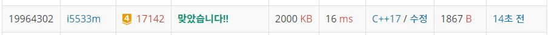

# 연구소 3

인체에 치명적인 바이러스를 연구하던 연구소에 승원이가 침입했고, 바이러스를 유출하려고 한다. 바이러스는 활성 상태와 비활성 상태가 있다. 가장 처음에 모든 바이러스는 비활성 상태이고, 활성 상태인 바이러스는 상하좌우로 인접한 모든 빈 칸으로 동시에 복제되며, 1초가 걸린다. 승원이는 연구소의 바이러스 M개를 활성 상태로 변경하려고 한다.  

연구소는 크기가 N×N인 정사각형으로 나타낼 수 있으며, 정사각형은 1×1 크기의 정사각형으로 나누어져 있다. 연구소는 빈 칸, 벽, 바이러스로 이루어져 있으며, 벽은 칸 하나를 가득 차지한다. 활성 바이러스가 비활성 바이러스가 있는 칸으로 가면 비활성 바이러스가 활성으로 변한다.  

예를 들어, 아래와 같이 연구소가 생긴 경우를 살펴보자. 0은 빈 칸, 1은 벽, 2는 바이러스의 위치이다.  

```
2 0 0 0 1 1 0
0 0 1 0 1 2 0
0 1 1 0 1 0 0
0 1 0 0 0 0 0
0 0 0 2 0 1 1
0 1 0 0 0 0 0
2 1 0 0 0 0 2
```

M = 3이고, 바이러스를 아래와 같이 활성 상태로 변경한 경우 6초면 모든 칸에 바이러스를 퍼뜨릴 수 있다. 벽은 -, 비활성 바이러스는 \*, 활성 바이러스는 0, 빈 칸은 바이러스가 퍼지는 시간으로 표시했다.  

```
* 6 5 4 - - 2
5 6 - 3 - 0 1
4 - - 2 - 1 2
3 - 2 1 2 2 3
2 2 1 0 1 - -
1 - 2 1 2 3 4
0 - 3 2 3 4 *
```

시간이 최소가 되는 방법은 아래와 같고, 4초만에 모든 칸에 바이러스를 퍼뜨릴 수 있다.  
```
0 1 2 3 - - 2
1 2 - 3 - 0 1
2 - - 2 - 1 2
3 - 2 1 2 2 3
3 2 1 0 1 - -
4 - 2 1 2 3 4
* - 3 2 3 4 *
```
연구소의 상태가 주어졌을 때, 모든 빈 칸에 바이러스를 퍼뜨리는 최소 시간을 구해보자.  

**입력**  
첫째 줄에 연구소의 크기 N(4 ≤ N ≤ 50), 놓을 수 있는 바이러스의 개수 M(1 ≤ M ≤ 10)이 주어진다.  

둘째 줄부터 N개의 줄에 연구소의 상태가 주어진다. 0은 빈 칸, 1은 벽, 2는 바이러스를 놓을 수 있는 위치이다. 2의 개수는 M보다 크거나 같고, 10보다 작거나 같은 자연수이다.          

**출력**  
연구소의 모든 빈 칸에 바이러스가 있게 되는 최소 시간을 출력한다. 바이러스를 어떻게 놓아도 모든 빈 칸에 바이러스를 퍼뜨릴 수 없는 경우에는 -1을 출력한다.    


**Example1:**   
```
7 3
2 0 0 0 1 1 0
0 0 1 0 1 2 0
0 1 1 0 1 0 0
0 1 0 0 0 0 0
0 0 0 2 0 1 1
0 1 0 0 0 0 0
2 1 0 0 0 0 2

4
```

**Example1:**   
```
7 3
2 0 2 0 1 1 0
0 0 1 0 1 2 0
0 1 1 2 1 0 0
2 1 0 0 0 0 2
0 0 0 2 0 1 1
0 1 0 0 0 0 0
2 1 0 0 2 0 2

4
```

## trial1
### Intuition
```
연구소3에서는 시간을 최대한 적게걸리는 방식으로 코딩을 해야했기때문에 visit도 n*n만큼만 사용하도록 하였고
함수를 불러올때 자동으로 초기화를 하도록 하였다. 그리고 deque를 사용하여 조합을 구할때에는 stack으로 사용하였고
bfs를 구할때에는 queue로 사용하였다. 또한 현재 선택된 바이러스 조합에서 나온 0(일반땅)에 대한 시간이 
이미 이전 조합에서 계산해 두었던 최소 시간보다 크다면 더이상 그 조합에 대해서는 계산하지 않아도 된다는 점이다.

연구소 3에서의 핵심은 바이러스를 고를때에는 조합 DFS를 사용하고 바이러스를 고른상태에서 퍼지게 할때에는
bfs를 사용하는 것이다.

그리고 문제에는 나와있지 않지만 만약에 바이러스가 퍼지는 길이 바이러스가 비활성화 되어있는 칸밖에 존재하지 않으면
그 길을 이용하고 똑같이 시간 증가는 시켜준다. 주의해야 할점은 비활성화 된 칸이 queue에서 마지막으로 방문하는 것이라면 시간을 카운트 하지 않는다.
```

### Codes  
```cpp
int n, v;
int arr[51][51] = { 0, };
int sec=2501;
int all = 0;
int xx[4] = { 0,0,1,-1 };
int yy[4] = { 1,-1,0,0 };
struct vi {
	int x, y;
	int min=0;
};
vector<vi> virus;
deque<vi> d;
void spread(deque<vi> dd) {
	vector<vector<bool>> visit(n, vector<bool>(n, false));
	vi cur;
	int nx, ny;
	int localmx = 0;
	int tmp = all;//방문해야하는 모든 영역 개수
	while (!dd.empty()) {
		cur = dd.front();
		dd.pop_front();
		if (!visit[cur.y][cur.x]) tmp--;
		
		visit[cur.y][cur.x] = true;
		if (localmx > sec) {//이미 시간 넘어가면 버려
			return;
		}
		if (arr[cur.y][cur.x] != 2) {//바이러스가 아닐때만 현재 시간을 재준다.
			localmx = max(cur.min, localmx);
		}
		for (int i = 0; i < 4; i++) {
			nx = cur.x + xx[i];
			ny = cur.y + yy[i];
			if (nx >= 0 && ny >= 0 && nx < n && ny < n) {
				if (!visit[ny][nx] && arr[ny][nx]!=1) {//벽이 아니고 visit하지 않은경우
					tmp--;
					visit[ny][nx] = true;
					vi nw;
					nw.x = nx;
					nw.y = ny;
					nw.min = cur.min + 1;
					dd.push_back(nw);
				}
			}
		}
	}
	if (tmp == 0) {
		sec = min(localmx, sec);
	}
}
void choose(int cur) {//조합
	if (d.size() == v) {
		spread(d);
	}
	else {
		for (int i = cur; i < virus.size(); i++) {
			d.push_back(virus[i]);
			choose(i + 1);
			d.pop_back();
		}
	}
}
```

### Results (Performance)    
**Runtime:**  16 ms   
**Memory Usage:** 	2000 kB    


<p align="center"> 

</p>


### 문제 URL (백준)  
https://www.acmicpc.net/problem/17142