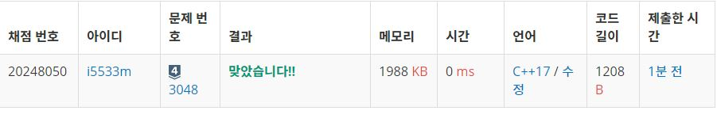

# 개미

개미가 일렬로 이동할 때, 가장 앞의 개미를 제외한 나머지 개미는 모두 앞에 개미가 한 마리씩 있다. 

서로 반대 방향으로 이동하던 두 개미 그룹이 좁은 길에서 만났을 때, 개미는 어떻게 지나갈까?

최근 연구에 의하면 위와 같은 상황이 벌어지면 개미는 서로를 점프해서 넘어간다고 한다.

즉, 두 그룹이 만났을 때, 1초에 한번씩 개미는 서로를 뛰어 넘는다. (한 개미가 다른 개미를 뛰어 넘고, 다른 개미는 그냥 전진한다고 생각해도 된다)

하지만 모든 개미가 점프를 하는 것은 아니다. 자신의 앞에 반대 방향으로 움직이던 개미가 있는 경우에만 점프를 하게 된다.

첫 번째 그룹이 ABC로 움직이고, 두 번째 그룹의 개미가 DEF순으로 움직인다고 하자. 그럼, 좁은 길에서 만났을 때, 개미의 순서는 CBADEF가 된다. 1초가 지났을 때는 자신의 앞에 반대방향으로 움직이는 개미가 있는 개미는 A와 D다. 따라서, 개미의 순서는 CBDAEF가 된다. 2초가 되었을 때, 자신의 앞에 반대 방향으로 움직이는 개미는 B,D,A,E가 있다. 따라서, 개미의 순서는 CDBEAF가 된다.

T초가 지난 후에 개미의 순서를 구하는 프로그램을 작성하시오.

입력
첫 번째 줄에 첫 번째 그룹의 개미의 수 N1과 두 번째 그룹의 개미의 수 N2가 주어진다.

다음 두 개 줄에는 첫 번째 그룹과 두 번째 그룹의 개미의 순서가 주어진다. 각 개미는 알파벳 대문자로 표현할 수 있으며, 두 그룹에서 중복되는 알파벳은 없다.

마지막 줄에는 T가 주어진다. (0 ≤ T ≤ 50)

출력
T초가 지난 후에 개미의 순서를 출력한다. 첫 번째 개미 그룹은 왼쪽에서 오른쪽으로 움직이고, 두 번째 그룹은 반대 방향으로 움직인다.

**Example1:**   
```
3 3
ABC
DEF
2

CDBEAF
```

**Example1:**   
```
4 3
ABCD
EFG
10

EFGDCBA
```

## trial1
### Intuition
```
Left 배열과 Right 배열을 따로 만들고 answer 배열을 따로 만들어서 L+R의 크기로 선언한다.
Left와 Right 배열의 순서는 각각 입력받은 순서대로 넣는다.
map에는 각 알파뱃에 대한 인덱스 값을 저장해 놓는다.
초를 입력받고 초만큼 반복해주는데 j라는 인덱스로 Left 배열 Right 배열의 각 요소들을 방문하면서 더이상 움직이지
않을때까지 Left 배열의 각 요소의 인덱스는 1씩 증가시켜주고
Right배열은 각요소의 인덱스를 1씩 감소시킨다.
그후에는 map의 각 요소들을 인덱스들에 맞게 answer 배열에 알파뱃들을 넣어준다.
```

### Codes  
```cpp
int main() {
	ios::sync_with_stdio(0);
	cin.tie(NULL);
	cout.tie(NULL);
	int L, R,T;
	//freopen("개미.txt", "r", stdin);
	cin >> L >> R;
	vector<char> LL,RR;//각 group에 대한 배열
	vector<char> ans(L+R);
	map<char, int> m;
	char tmp;
	for (int i = L - 1; i >= 0; i--) {//map에 L에 대한 인덱스 넣기
		cin>>tmp;
		m[tmp] = i;
		LL.push_back(tmp);
	}
	for (int i = L; i < L + R; i++) {//map에 R에 대한 인덱스 넣기
		cin >> tmp;
		m[tmp] = i;
		RR.push_back(tmp);
	}
	cin >> T;//시간 받기
	for (int i = 1; i <= T; i++) {//시간만큼 돌리기
		for (int j = 0; j < i; j++) {//초만큼 움직임이 시작됨
			//범위 안에 있을때만 움직임
			if((i-R)<=j && j<L) m[LL[j]]++; //L은 R의 개수만큼 더 움직여야 해서 i초-R보다 큰 인덱스만 한다.
			if((i-L)<=j && j<R) m[RR[j]]--;//R은 L의 개수만큼 더 움직여야 하니까 i-L보다 큰 인덱스만 움직인다.
		}
	}
	for (auto it : m) {//ans 배열에 값들 다 집어넣기
		ans[it.second] = it.first;
	}
	for (char s : ans) {//출력
		cout << s;
	}
	return 0;
}
```

### Results (Performance)    
**Runtime:**  0 ms   
**Memory Usage:** 	1984 kB    


<p align="center"> 

</p>


### 문제 URL (백준)  
https://www.acmicpc.net/problem/3048