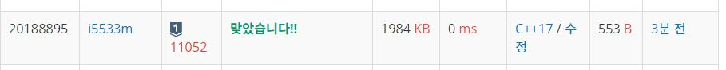

# 카드구매하기

요즘 민규네 동네에서는 스타트링크에서 만든 PS카드를 모으는 것이 유행이다.

PS카드는 PS(Problem Solving)분야에서 유명한 사람들의 아이디와 얼굴이 적혀있는 카드이다. 각각의 카드에는 등급을 나타내는 색이 칠해져 있고, 다음과 같이 8가지가 있다.

전설카드
레드카드
오렌지카드
퍼플카드
블루카드
청록카드
그린카드
그레이카드
카드는 카드팩의 형태로만 구매할 수 있고, 카드팩의 종류는 카드 1개가 포함된 카드팩, 카드 2개가 포함된 카드팩, ... 카드 N개가 포함된 카드팩과 같이 총 N가지가 존재한다.

민규는 카드의 개수가 적은 팩이더라도 가격이 비싸면 높은 등급의 카드가 많이 들어있을 것이라는 미신을 믿고 있다. 따라서, 민규는 돈을 최대한 많이 지불해서 카드 N개 구매하려고 한다. 카드가 i개 포함된 카드팩의 가격은 Pi원이다.

예를 들어, 카드팩이 총 4가지 종류가 있고, P1 = 1, P2 = 5, P3 = 6, P4 = 7인 경우에 민규가 카드 4개를 갖기 위해 지불해야 하는 금액의 최댓값은 10원이다. 2개 들어있는 카드팩을 2번 사면 된다.

P1 = 5, P2 = 2, P3 = 8, P4 = 10인 경우에는 카드가 1개 들어있는 카드팩을 4번 사면 20원이고, 이 경우가 민규가 지불해야 하는 금액의 최댓값이다.

마지막으로, P1 = 3, P2 = 5, P3 = 15, P4 = 16인 경우에는 3개 들어있는 카드팩과 1개 들어있는 카드팩을 구매해 18원을 지불하는 것이 최댓값이다.

카드 팩의 가격이 주어졌을 때, N개의 카드를 구매하기 위해 민규가 지불해야 하는 금액의 최댓값을 구하는 프로그램을 작성하시오. N개보다 많은 개수의 카드를 산 다음, 나머지 카드를 버려서 N개를 만드는 것은 불가능하다. 즉, 구매한 카드팩에 포함되어 있는 카드 개수의 합은 N과 같아야 한다.

**Example1:**   
```
4
1 5 6 7

10
```

**Example1:**   
```
5
10 9 8 7 6


50
```

## trial1
### Intuition
```
처음에는 카드한장당 가격이 가장 비싼 카드 패키지를 기준으로 구하려고 했으나 이방법은 틀린 예제가 있었다.

10
1 100 160 1 1 1 1 1 1 1

answer: 520
output: 481

이 예제이다. 이 예제는 가격이 비싼 카드 패키지를 기준을 구하게 되면 정답을 구할 수 없다.
```

### Codes  
```cpp
#include <iostream>
#include <vector>
#pragma warning (disable:4996)
using namespace std;
int N;
int main() {
	//freopen("카드구매하기.txt", "r", stdin);
	cin >> N;
	vector<int> card;
	vector<int> dp;
	int tmp = 0;
	dp.push_back(0);
	cin >> tmp;
	dp.push_back(tmp);
	int j = 0;
	for (int i = 2; i <= N; i++) {
		cin >> tmp;
		dp.push_back(tmp);
		j = 1;
		while (j <= (i / 2)) {
			dp[i] = max(dp[i],dp[i - j]+dp[j]);
			j++;
		}
	}
	cout << dp[N];
	return 0;
}
```

## trial1
### Intuition
```
위의 예제가 제대로 안되었기 때문에 새로운 방법을 생각하였다.
반으로 나눈값까지 반복문을 돌려주어서 그중 가장 큰 패키지의 조합이
나오면 그 값으로 업데이트 해주는 방법이다.
trial 1에서는 너무 퍼포먼스만 생각하고 풀어서 예외처리를 못한것같다.
```

### Codes  
```cpp
int main() {
	//freopen("카드구매하기.txt", "r", stdin);
	cin >> N;
	vector<int> card;
	vector<int> dp;
	int tmp = 0;
	card.push_back(0);
	dp.push_back(0);
	cin >> tmp;
	card.push_back(tmp);
	dp.push_back(tmp);
	int j = 0;
	for (int i = 2; i <= N; i++) {
		cin >> tmp;
		card.push_back(tmp);
		dp.push_back(tmp);
		j = 1;
		while (j <= (i / 2)) {
			dp[i] = max(dp[i],dp[i - j]+dp[j]);
			j++;
		}
	}
	cout << dp[N];
	return 0;
}
```

### Results (Performance)    
**Runtime:**  0 ms   
**Memory Usage:** 	1984 kB    


<p align="center"> 

</p>


### 문제 URL (백준)  
https://www.acmicpc.net/problem/11052