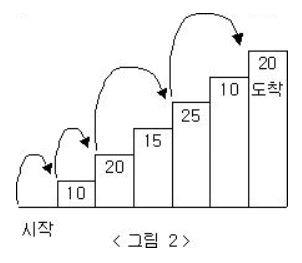
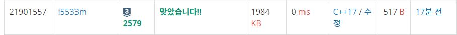

# 계단 오르기  

문제  
계단 오르기 게임은 계단 아래 시작점부터 계단 꼭대기에 위치한 도착점까지 가는 게임이다. <그림 1>과 같이 각각의 계단에는 일정한 점수가 쓰여 있는데 계단을 밟으면 그 계단에 쓰여 있는 점수를 얻게 된다.  

<p align="center"> 

</p>

예를 들어 <그림 2>와 같이 시작점에서부터 첫 번째, 두 번째, 네 번째, 여섯 번째 계단을 밟아 도착점에 도달하면 총 점수는 10 + 20 + 25 + 20 = 75점이 된다.  

<p align="center"> 

</p>

계단 오르는 데는 다음과 같은 규칙이 있다.  
```
1.계단은 한 번에 한 계단씩 또는 두 계단씩 오를 수 있다. 즉, 한 계단을 밟으면서 이어서 다음 계단이나, 다음 다음 계단으로 오를 수 있다.  
2.연속된 세 개의 계단을 모두 밟아서는 안 된다. 단, 시작점은 계단에 포함되지 않는다.  
3.마지막 도착 계단은 반드시 밟아야 한다. 
``` 
따라서 첫 번째 계단을 밟고 이어 두 번째 계단이나, 세 번째 계단으로 오를 수 있다. 하지만, 첫 번째 계단을 밟고 이어 네 번째 계단으로 올라가거나, 첫 번째, 두 번째, 세 번째 계단을 연속해서 모두 밟을 수는 없다.  
각 계단에 쓰여 있는 점수가 주어질 때 이 게임에서 얻을 수 있는 총 점수의 최댓값을 구하는 프로그램을 작성하시오.  

입력
입력의 첫째 줄에 계단의 개수가 주어진다.  

둘째 줄부터 한 줄에 하나씩 제일 아래에 놓인 계단부터 순서대로 각 계단에 쓰여 있는 점수가 주어진다. 계단의 개수는 300이하의 자연수이고, 계단에 쓰여 있는 점수는 10,000이하의 자연수이다.  
 
출력
첫째 줄에 계단 오르기 게임에서 얻을 수 있는 총 점수의 최댓값을 출력한다.  

## Example1

```
Input: 
6
10
20
15
25
10
20

Output: 
75
```
## Example2

```
Input: 
6
1 1 0 0 1 1
Output:
4
```

## Example3
```
Input: 
3
3 3 2
Output:
5
```

## trial2
### Intuition
```
이 방법은 현재 계단을 기준으로 3번째의 최적의 값 계단값과 바로 이전계단의 값 현재 자리의 값을 
더한것이 큰지 혹은 2번째의 최적의 값에서 현재 계단값을 더한것 중에 큰것을 현재 계단의 최적의 값으로 업데이트
하는 방법이다. 
```
### Codes  
```cpp
int main() {
    int N;
    //freopen("계단오르기.txt", "r", stdin);
    cin >> N;
    vector<int> v;
    v.push_back(0);
    vector<int> v2;
    v2.push_back(0);
    for (int i = 0; i < N; i++) {
        int tmp;
        cin >> tmp;
        v.push_back(tmp);
        v2.push_back(0);
    }
    v2[1] = v[1];
    v2[2] = v[1] + v[2];
    for (int i = 3; i <= N; i++) {
        v2[i] = max(v[i] + v2[i - 2], v[i] + v[i - 1] + v2[i - 3]);
    }
    cout << v2[N];
    return 0;
}
```

### Results (Performance)  
**Runtime:** 0 ms 
**Memory Usage:** 	1984 kb 

<p align="center"> 

</p>


### 문제 URL (백준)  
https://www.acmicpc.net/problem/2579