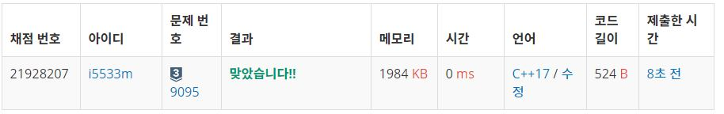

# 파도반수열

정수 4를 1, 2, 3의 합으로 나타내는 방법은 총 7가지가 있다. 합을 나타낼 때는 수를 1개 이상 사용해야 한다.  

1+1+1+1
1+1+2
1+2+1
2+1+1
2+2
1+3
3+1
정수 n이 주어졌을 때, n을 1, 2, 3의 합으로 나타내는 방법의 수를 구하는 프로그램을 작성하시오.  

입력
첫째 줄에 테스트 케이스의 개수 T가 주어진다. 각 테스트 케이스는 한 줄로 이루어져 있고, 정수 n이 주어진다.   n은 양수이며 11보다 작다.  

출력
각 테스트 케이스마다, n을 1, 2, 3의 합으로 나타내는 방법의 수를 출력한다.  

## Example1

```
Input: 
2
6
12

Output: 
3
16
```

## trial1
### Intuition
```
이문제 또한 쉽게 규칙만 찾으면 풀 수 있는 문제이다.
여기서 1,2,3의 합으로 N을 만들수 있는 경우의 수를 구하는 것인데
N에서 1을 뺐을때의 경우의 수와 2를 뺐을때의 경우의수 3읠 뺐을때의 경우의수의 합과 같다
그 이유는 이전에 구해두었던 숫자들의 조합에 각각 1,2,3만 더하면 N을 만들 수 있게 되기 때문이다.
```
### Codes  
```cpp
int main() {
    freopen("123더하기.txt", "r", stdin);
    int tc;
    cin >> tc;
    vector<long long> v;
    v.push_back(1);
    v.push_back(1);
    v.push_back(2);
    v.push_back(4);
    for (int t = 0; t < tc; t++) {
        long long N;
        cin >> N;
        for (int j = v.size(); j <= N; j++) {
            long long sum = 0;
            for (int i = 1; i <= 3; i++) {
                sum += v[j - i];
            }
            v.push_back(sum);
        }
        cout << v[N] << endl;
    }
    return 0;
}
```

### Results (Performance)  
**Runtime:** 0 ms 
**Memory Usage:** 	1984 kb 

<p align="center"> 

</p>


### 문제 URL (백준)  
https://www.acmicpc.net/problem/9095