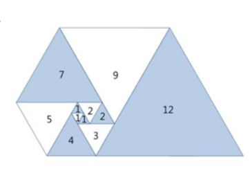
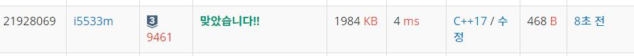

# 파도반수열

오른쪽 그림과 같이 삼각형이 나선 모양으로 놓여져 있다. 첫 삼각형은 정삼각형으로 변의 길이는 1이다. 그 다음에는 다음과 같은 과정으로 정삼각형을 계속 추가한다. 나선에서 가장 긴 변의 길이를 k라 했을 때, 그 변에 길이가 k인 정삼각형을 추가한다.

파도반 수열 P(N)은 나선에 있는 정삼각형의 변의 길이이다. P(1)부터 P(10)까지 첫 10개 숫자는 1, 1, 1, 2, 2, 3, 4, 5, 7, 9이다.

N이 주어졌을 때, P(N)을 구하는 프로그램을 작성하시오.

 
<p align="center"> 

</p>

입력
첫째 줄에 테스트 케이스의 개수 T가 주어진다. 각 테스트 케이스는 한 줄로 이루어져 있고, N이 주어진다. (1 ≤ N ≤ 100)

출력
각 테스트 케이스마다 P(N)을 출력한다.

## Example1

```
Input: 
2
6
12

Output: 
3
16
```

## trial2
### Intuition
```
쉽게 규칙을 찾으면 되는 문제였는데 여기서 주의해야할 점은 long long으로 데이터 형식이어야 한다는 것이다.

규칙은 3번째 전과 2번째 전 값을 더하면 현재 값이 나온다.

```
### Codes  
```cpp
int main() {
    freopen("파도반 수열.txt", "r", stdin);
    int tc;
    cin >> tc;
    vector<long long> v;
    v.push_back(1);
    v.push_back(1);
    v.push_back(1);
    for (int t = 0; t < tc; t++) {
        long long N;
        cin >> N;
        for (int i = v.size(); i < N; i++) {
            long long tmp = v[i - 3] + v[i - 2];
            v.push_back(tmp);
        }
        cout << v[N-1]<<endl;
    }
    return 0;
}
```

### Results (Performance)  
**Runtime:** 4 ms 
**Memory Usage:** 	1984 kb 

<p align="center"> 

</p>


### 문제 URL (백준)  
https://www.acmicpc.net/problem/9461