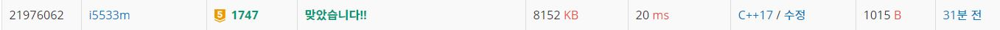

# 소수&팰린드롬

어떤 수와 그 수의 숫자 순서를 뒤집은 수가 일치하는 수를 팰린드롬이라 부른다. 예를 들어 79,197과 324,423 등이 팰린드롬 수이다.

어떤 수 N (1 ≤ N ≤ 1,000,000)이 주어졌을 때, N보다 크거나 같고, 소수이면서 팰린드롬인 수 중에서, 가장 작은 수를 구하는 프로그램을 작성하시오.

입력
첫째 줄에 N이 주어진다.

출력
첫째 줄에 조건을 만족하는 수를 출력한다.

## Example1

```
Input: 
31

Output: 
101
```

## Example2

```
Input: 
1003000

Output: 
1003001
```

## trial1
### Intuition
```
백준의 질문검색에서 팰린드롬은 극히 드믈기 때문에 먼저 판별해준 후에 소수를 판별하는 것이 좋다고 하여
그방법으로 문제를 풀어보았으나 문제는 팰린드롬이 나올때마다 소수를 반별해주면 당연히 시간이 많이 걸렸다.
그렇다고 vector v를 전역변수로 선언해놓고 팰린드롬이 나올때마다 v의 크기를 늘려서 prime을 추가적으로 확인
해주는 방법은 코드가 복잡해질 것같아서 다른 방법을 이용해보기로 했다.
```
### Codes  
```cpp
bool ispalin(int a) {//팔린드롬인지 확인
    string s = to_string(a);
    for (int i = 0; i < s.size()/2; i++) {
        if (s[i] != s[s.size() - i - 1]) return false;
    }
    return true;
}
bool isPrime(int a) {//에라토스의체 알고리즘 사용
    vector<int> v;
    for (int i = 0; i <= a; i++) {
        v.push_back(i);
    }
    for (int i = 2; i <= sqrt(a) && v[a]>0; i++) {//a의 제곱근까지만 진행 제곱근 이후로는 
        if (v[i] != 0) {//이미 체크되지 않은경우
            for (int j = i+i; j <= a; j += i) {//배수인 애들 모두 0으로 표시
                v[j] = 0;
            }
        }
    }
    if (v[a] != 0) return true;
    return false;
}
int main() {
    freopen("소수와팰린드럼.txt", "r", stdin);
    int N;
    cin >> N;
    int i = N;
    if (i == 1) {
        i++;
    }
    else {
        while (i <= 1003002) {
            if (ispalin(i)) {
                bool is = isPrime(i);
                if (is) {
                    break;
                }
            }
            i++;
        }
    }
    cout << i << endl;
    return 0;
}
```
### Results (Performance)  
시간초과


## trial2
### Intuition
```
trial1에서 시간초과가 나서 다른 방법을 생각 해 본것은 input 값인 N의 최대값으로 나오는 결과값까지
에라토스테네스의 체로 모든 소수를 먼저 구한후에 팰린드롬인지 판별해주는 방법이다.
에라토스테네스 알고리즘 자체가 매우 효율적이기 때문에 큰 숫자에 대해서 소수들을 모두 구해주더라도
걸리는 시간은 그리 크지 않다.

에라토스테네스 알고리즘은
자기자신을 제외한 배수들을 모두 걸러주는 방식으로 이미 걸러준 이력이 있으면 건너띄어서 진행하는 방식이다.

```
### Codes  
```cpp
bool ispalin(int a) {//팔린드롬인지 확인
    string s = to_string(a);
    for (int i = 0; i < s.size()/2; i++) {
        if (s[i] != s[s.size() - i - 1]) return false;
    }
    return true;
}
bool isPrime(int a) {//에라토스의체 알고리즘 사용
    for (int i = v.size(); i <= a; i++) {
        v.push_back(i);
    }
    for (int i = 2; i <= sqrt(a) && v[a]>0; i++) {//a의 제곱근까지만 진행 제곱근 이후로는 
        if (v[i] != 0) {//이미 체크되지 않은경우
            for (int j = i+i; j <= a; j += i) {//배수인 애들 모두 0으로 표시
                v[j] = 0;
            }
        }
    }
    if (v[a] != 0) return true;
    return false;
}
int main() {
    freopen("소수와팰린드럼.txt", "r", stdin);
    int N;
    cin >> N;
    int i = N;
    if (i == 1) {
        i++;
    }
    else {
        while (i <= 1003002) {
            if (ispalin(i)) {
                bool is = isPrime(i);
                if (is) {
                    break;
                }
            }
            i++;
        }
    }
    cout << i << endl;
    return 0;
}
```

### Results (Performance)  
**Runtime:** 20 ms 
**Memory Usage:** 	8152 kb 

<p align="center"> 

</p>


### 문제 URL (백준)  
https://www.acmicpc.net/problem/1747