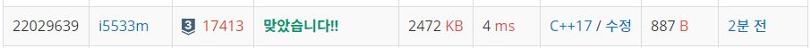

# 소수&팰린드롬

문자열 S가 주어졌을 때, 이 문자열에서 단어만 뒤집으려고 한다.

먼저, 문자열 S는 아래와과 같은 규칙을 지킨다.

알파벳 소문자('a'-'z'), 숫자('0'-'9'), 공백(' '), 특수 문자('<', '>')로만 이루어져 있다.
문자열의 시작과 끝은 공백이 아니다.
'<'와 '>'가 문자열에 있는 경우 번갈아가면서 등장하며, '<'이 먼저 등장한다. 또, 두 문자의 개수는 같다.
태그는 '<'로 시작해서 '>'로 끝나는 길이가 3 이상인 부분 문자열이고, '<'와 '>' 사이에는 알파벳 소문자와 공백만 있다. 단어는 알파벳 소문자와 숫자로 이루어진 부분 문자열이고, 연속하는 두 단어는 공백 하나로 구분한다. 태그는 단어가 아니며, 태그와 단어 사이에는 공백이 없다.

입력
첫째 줄에 문자열 S가 주어진다. S의 길이는 100,000 이하이다.

출력
첫째 줄에 문자열 S의 단어를 뒤집어서 출력한다.

## Example1

```
Input: 
baekjoon online judge

Output: 
noojkeab enilno egduj
```

## Example2

```
Input: 
<int><max>2147483647<long long><max>9223372036854775807

Output: 
<int><max>7463847412<long long><max>7085774586302733229
```

## trial1
### Intuition
```
str이 스택구조로 되어있는 점을 이용하여 괄호가 아닌경우에는 tmp라는 string에 넣고 
괄호가 나온경우에는 그대로 ans에 넣는 방식으로 문제를 해결하였따.
여기서 크기가 주어지지 않았을때 str을 사용자로부터 받는 방법은 geline을 사용한다는 점이었다.
```
### Codes  
```cpp
int main() {
    //freopen("단어뒤집기2.txt", "r", stdin);
    string str,tmp="",ans;
    getline(cin, str);
    bool par = false;
    for (int i = 0; i < str.size(); i++) {
        if (str[i] == '<') {//괄호면 queue에 넣기
            par = true;
            while (tmp.size() > 0) {
                char c = tmp.back();
                tmp.pop_back();
                ans.push_back(c);
            }
        }
        if (par) {
            ans.push_back(str[i]);
            if (str[i] == '>') {//뒷괄호면
                par = false;
            }
        }
        else {
            if (str[i] == ' ') {
                while (tmp.size() > 0) {
                    char c = tmp.back();
                    tmp.pop_back();
                    ans.push_back(c);
                }
                ans.push_back(str[i]);
            }
            else {
                tmp.push_back(str[i]);
            }
        }
    }
    while (tmp.size() > 0) {
        char c = tmp.back();
        tmp.pop_back();
        ans.push_back(c);
    }
    cout << ans << endl;
    return 0;
}
```
### Results (Performance)  
**Runtime:** 4 ms   
**Memory Usage:**   2472 kb    

<p align="center"> 

</p>


### 문제 URL (백준)  
https://www.acmicpc.net/problem/17413