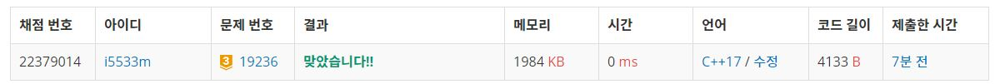

# 청소년 상어

4×4크기의 공간이 있고, 크기가 1×1인 정사각형 칸으로 나누어져 있다. 공간의 각 칸은 (x, y)와 같이 표현하며, x는 행의 번호, y는 열의 번호이다. 한 칸에는 물고기가 한 마리 존재한다. 각 물고기는 번호와 방향을 가지고 있다. 번호는 1보다 크거나 같고, 16보다 작거나 같은 자연수이며, 두 물고기가 같은 번호를 갖는 경우는 없다. 방향은 8가지 방향(상하좌우, 대각선) 중 하나이다.

오늘은 청소년 상어가 이 공간에 들어가 물고기를 먹으려고 한다. 청소년 상어는 (0, 0)에 있는 물고기를 먹고, (0, 0)에 들어가게 된다. 상어의 방향은 (0, 0)에 있던 물고기의 방향과 같다. 이후 물고기가 이동한다.

물고기는 번호가 작은 물고기부터 순서대로 이동한다. 물고기는 한 칸을 이동할 수 있고, 이동할 수 있는 칸은 빈 칸과 다른 물고기가 있는 칸, 이동할 수 없는 칸은 상어가 있거나, 공간의 경계를 넘는 칸이다. 각 물고기는 방향이 이동할 수 있는 칸을 향할 때까지 방향을 45도 반시계 회전시킨다. 만약, 이동할 수 있는 칸이 없으면 이동을 하지 않는다. 그 외의 경우에는 그 칸으로 이동을 한다. 물고기가 다른 물고기가 있는 칸으로 이동할 때는 서로의 위치를 바꾸는 방식으로 이동한다.

물고기의 이동이 모두 끝나면 상어가 이동한다. 상어는 방향에 있는 칸으로 이동할 수 있는데, 한 번에 여러 개의 칸을 이동할 수 있다. 상어가 물고기가 있는 칸으로 이동했다면, 그 칸에 있는 물고기를 먹고, 그 물고기의 방향을 가지게 된다. 이동하는 중에 지나가는 칸에 있는 물고기는 먹지 않는다. 물고기가 없는 칸으로는 이동할 수 없다. 상어가 이동할 수 있는 칸이 없으면 공간에서 벗어나 집으로 간다. 상어가 이동한 후에는 다시 물고기가 이동하며, 이후 이 과정이 계속해서 반복된다.

입력
첫째 줄부터 4개의 줄에 각 칸의 들어있는 물고기의 정보가 1번 행부터 순서대로 주어진다. 물고기의 정보는 두 정수 ai, bi로 이루어져 있고, ai는 물고기의 번호, bi는 방향을 의미한다. 방향 bi는 8보다 작거나 같은 자연수를 의미하고, 1부터 순서대로 ↑, ↖, ←, ↙, ↓, ↘, →, ↗ 를 의미한다.

출력
상어가 먹을 수 있는 물고기 번호의 합의 최댓값을 출력한다.


## Example1

```
Input: 
7 6 2 3 15 6 9 8
3 1 1 8 14 7 10 1
6 1 13 6 4 3 11 4
16 1 8 7 5 2 12 2

Output: 
33
```

## Example2

```
Input: 
12 6 14 5 4 5 6 7
15 1 11 7 3 7 7 5
10 3 8 3 16 6 1 1
5 8 2 7 13 6 9 2

Output: 
76
```

## trial1
### Intuition
```
상어가 물고기를 잡아먹을때에는 dfs를 사용해서 문제를 해결했고
물고기들의 움직임은 물고기 배열을 모두 방문하면서 각 인덱스의 물고기에 대한 방향을 정해주어 다음 움직일
좌표를 구하고 해당 물고기와 교체하는 방식으로 했다.
이때 중요한 점은 dfs를 돌려주는 과정에서는 fish 배열에 대한 백업 그리고 현재 물고기들과 상어의 위치를
나타내주는 map에 대한 백업이 필요하다.
그렇게 해야지만 dfs를 수행하면서 상태값들을 정확하게 저장할 수 있기 때문이다.
```
### Codes  
```cpp
int xx[] = { 0,0,-1,-1,-1,0,1,1,1 };
int yy[] = { 0,-1,-1,0,1,1,1,0,-1 };
//0: 제자리 1:↑, 2:↖,3: ←, 4:↙, 5:↓,6: ↘,7:→,8:↗
int mx = 0;
struct fish {
    int x = 0;
    int y = 0;
    int dir=0;
    int num=0;
    bool live = true;
};
struct shark {
    int x=0;
    int y=0;
    int total = 0;
    int dir=0;
};
fish ff[17];
int map[4][4] = { 0, };
void copystate(int from[][4], int to[][4],fish from2[],fish to2[]) {
    for (int i = 0; i < 4; i++) {
        for (int j = 0; j < 4; j++) {
            to[i][j] = from[i][j];
        }
    }
    for (int i = 1; i < 17; i++) {
        to2[i] = from2[i];
    }
}
void swapfish(fish &a, fish &b) {
    map[a.y][a.x] = b.num;
    map[b.y][b.x] = a.num;
    fish tmp = a;
    a.x = b.x;
    a.y = b.y;
    b.x = tmp.x;
    b.y = tmp.y;
}
void movefish() {
    int nx, ny;
    for (int i = 1; i < 17; i++) {//모든 물고기에 대해서 돌기
        if (ff[i].live) {//살아있는 경우에만
            int curdir = ff[i].dir;//현재 방향 넣기
            nx = ff[i].x + xx[curdir];
            ny = ff[i].y + yy[curdir];
            bool ch = false;
            while (nx < 0 || ny < 0 || nx >= 4 || ny >= 4 || map[ny][nx]<0) {//방향 정해주기
                curdir++;
                if (curdir == 9) curdir = 1;//인덱스 범위 넘어가면
                if (curdir == ff[i].dir) {//한바퀴 돌아서 다시 같아졌을때
                    ch = true;
                    break;//계속 돌다가 원래를 만난경우
                }
                nx = ff[i].x + xx[curdir];
                ny = ff[i].y + yy[curdir];
            }
            if (!ch) {
                ff[i].dir = curdir;//방향 바꿔주고 방향의 물고기와 스위치
                if (map[ny][nx] == 0) {
                    map[ny][nx] = ff[i].num;
                    map[ff[i].y][ff[i].x] = 0;
                    ff[i].x = nx;
                    ff[i].y = ny;
                }
                else {
                    swapfish(ff[i], ff[map[ny][nx]]);
                }
            }
        }
    }
}

void eatfish(bool eat,int ny,int nx,shark &cur,int curfish) {//
    if (eat) {//먹을때 shark의 방향 자리 다 바꾸기
        map[cur.y][cur.x] = 0;//현재 상어의 위치는 비어있는걸로
        map[ny][nx] = -1;//다음 상어의 위치는 -1인걸로
        //상어 이동
        cur.y = ny;
        cur.x = nx;
        cur.total += curfish;//상어 먹은거 total 업데이트
        cur.dir = ff[curfish].dir;//다음 위치의 물고기에서 방향 가져오기
        ff[curfish].live = false;//물고기 쥬금s
    }
    else {//다시 되돌릴때
        map[cur.y][cur.x] = curfish;//상어위치 빡구
        map[ny][nx] = -1;
        ff[curfish].live = true;//물고기 다시 부활

    }
}
void dfs(shark s) {//물고기 움직이고~ 상어 움직이는 dfs
    mx = max(s.total, mx);//먹은 개수가 크면 저장
    //map의 상태 복사 해놓기
    int tmp[4][4] = { 0, };
    fish tmpf[17];
    copystate(map, tmp,ff,tmpf);
    movefish();//그다음에 물고기들 움직여주기
    //print2(tmp);
    //선택지는 최대 3가지
    int nx, ny;
    for (int i = 1; i < 4; i++) {
        nx = s.x + (xx[s.dir]*i);
        ny = s.y + (yy[s.dir] * i);
        if (nx >= 0 && ny >= 0 && nx < 4 && ny < 4 && map[ny][nx]>0) {//범위 안이고 물고기가 있는경우에만 이동
            //다음위치로 갈때 fish 먹기
            shark tmp2;
            tmp2 = s;//상어 현재위치 일단 저장
            int curfish = map[ny][nx];//현재 물고기 크기 저장
            eatfish(true,ny,nx,s,curfish );//다음 위치를 미리 먹는다. (상어상태도 변함)
            //print(s);
            dfs(s);//바뀐 상어위치 기준
            eatfish(false, tmp2.y, tmp2.x, s, curfish);//상태 되돌리기
            s = tmp2;//상어 다시 되돌리기
        }
        
    }
    copystate(tmp, map,tmpf,ff);//다시 맵상태 되돌려주기
}
```

### Results (Performance)  
**Runtime:** 0 ms   
**Memory Usage:**   1984 kb    

<p align="center"> 

</p>


### 문제 URL (백준)  
https://www.acmicpc.net/problem/19236