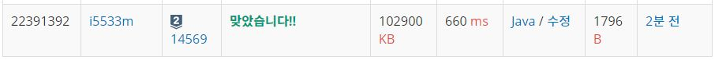

# 시간표 짜기

문제
연세대학교 수강신청 기간이 시작되었다. 많은 친구들은 비어 있는 시간에 어떤 과목을 추가로 신청할 수 있는지를 궁금해 한다.

이 친구들이 비어 있는 시간에 추가로 신청할 수 있는 과목의 후보 개수를 구해보자.

후보 개수를 세는 것이므로 현재 내 시간표에서 신청할 수 있는 과목끼리 시간이 겹치더라도 모두 세어야 한다.

즉, 월요일 1, 2, 3, 4, 5교시 시간이 비어 있고 한 과목의 시간이 월요일 1, 2, 3, 4교시이고 나머지 한 과목의 시간이 월요일 2, 3, 4, 5교시라면 2과목 모두 후보가 될 수 있다.

입력
연세대학교의 총 과목의 수 N (3 ≤ N ≤ 1000)이 주어진다.

N줄에 걸쳐서 각 과목의 수업시간의 수 k (4 ≤ k ≤ 50)가 주어지고 그 옆에 k개의 숫자 ti (1 ≤ ti ≤ 50)가 공백으로 구분되어 주어진다.

ti는 이 과목의 수업이 진행되는 교시를 의미하며 1 ~ 50의 값을 가진다.

(월요일 1~10교시: 1~10, 화요일 1~10교시: 11~20, …)

다음 줄에 학생수 M (1 ≤ M ≤ 10000) 이 주어진다.

M줄에 걸쳐서 각 학생들의 비어 있는 교시 개수 p (0 ≤ p ≤ 50)가 주어지고 그 옆에 p개의 숫자 qi (1 ≤ qi ≤ 50)가 공백으로 구분되어 주어진다.

Ex) 알고리즘의 수업시간이 화요일 2, 3교시, 수요일 4, 5교시라면 다음과 같이 입력이 주어진다.

4 12 13 24 25
출력
M줄에 걸쳐서 각 학생들의 들을 수 있는 과목 개수를 출력한다.


## Example1

```
Input: 
3
4 1 2 3 4
6 5 6 7 8 9 10
4 11 21 31 41
5
8 1 2 3 4 5 6 7 8
7 1 2 3 7 8 9 10
14 1 2 3 4 5 6 7 8 9 10 11 21 31 41
5 41 42 43 44 45
10 1 5 6 7 8 9 10 11 21 31

Output: 
1
0
3
0
1
```

## trial1
### Intuition
```
비트마스킹 방법으로 문제를 해결하였고 과목들에 대해서 비트를 1로 올려준 후에
학생들이 비어있는 시간을 제외하고 모두 1로 만들고
과목들의 비트와 학생들의 비어있지 않은 시간 비트와 and 연산하여 0이된다면 과목을 넣을수 있는 것으로
간주하고 cnt를 +1해준다.
```
### Codes  
```cpp
public class Main{

    public static void main(String[] args) throws IOException {
        // TODO Auto-generated method stub
        BufferedReader br=new BufferedReader(new InputStreamReader(System.in));
        StringTokenizer st = new StringTokenizer(br.readLine());
        int n=Integer.parseInt(st.nextToken());
        int tmp;
        BigInteger [] crs=new BigInteger[1001];
        for(int i=0;i<n;i++) {//과목들
            st=new StringTokenizer(br.readLine());
            tmp=Integer.parseInt(st.nextToken());
            crs[i]=new BigInteger("0");
            for(int j=0;j<tmp;j++) {//과목들에 대한 비트를 표시한다.
                BigInteger bg=new BigInteger("1");
                bg=bg.shiftLeft(Integer.parseInt(st.nextToken()));
                crs[i]=crs[i].or(bg);
            }
        }
        
        //long[][] empsp = new long[10001][50];
        st=new StringTokenizer(br.readLine());
        BigInteger zero=new BigInteger("0");
        int m=Integer.parseInt(st.nextToken());
        for(int i=0;i<m;i++) {
            int cnt=0;
            BigInteger tmp2=new BigInteger("0");
            st=new StringTokenizer(br.readLine());
            tmp=Integer.parseInt(st.nextToken());
            for(int j=0;j<tmp;j++) {
            BigInteger bg=new BigInteger("1");
            tmp2=tmp2.or(bg.shiftLeft(Integer.parseInt(st.nextToken())));
            }
            tmp2=tmp2.not();//비어있지 않은 시간을 구한다.
            for(int j=0;j<n;j++) {//과목들과 비어있지 않은 시간을 and 연산하여 0이면 과목을 넣을수 있다는 뜻이다.
                if(tmp2.and(crs[j]).compareTo(zero)==0) cnt++;
            }
            StringBuilder sb = new StringBuilder();
            sb.append(cnt).append("\n");
            System.out.print(sb);
        }
    }

}
```

### Results (Performance)  
**Runtime:** 660 ms   
**Memory Usage:**   102900 kb    

<p align="center"> 

</p>


### 문제 URL (백준)  
https://www.acmicpc.net/problem/19236