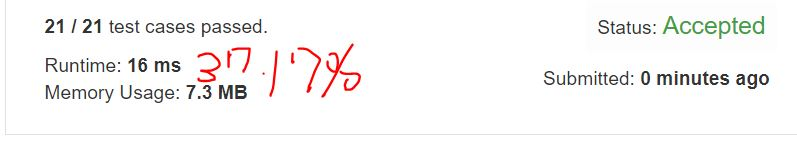

# 283. Move Zeroes
Given an array nums, write a function to move all 0's to the end of it while maintaining the relative order of the non-zero elements. 

**Note**
1.  You must do this in-place without making a copy of the array.
2.  Minimize the total number of operations. 

**Example1:**   
```
Input: [0,1,0,3,12]
Output: [1,3,12,0,0]
```

## trial1
### Intuition
```
0이 나올때마다 vector의 함수중 erase 함수를 사용하여 지워주고 다시 push back으로 0을 삽입해 주는 방법을 사용하였다. 그리고 i는 계속 증가를 하기 때문에 만약에 0이 뒤로 이동 된 이후에 i번째 값이 또다시 0이라면 0인 인덱스부터 다시 돌아야하므로 i에 1을 뺄셈을 해준다. plus 변수는 이미 pushback이 된 0에 대하여 반복문을 도는것을 방지하기 위해 만든 것이다.

Whenever 0 comes out, I erased it using the erase function among the functions of the vector and inserted a 0 back into the push back. Also, since i continues to increase, if the i-th value is 0 again after 0 is moved back, the index of 0 must be returned, so subtract 1 from i. The plus variable was created to prevent looping over the already pushed zero.
```
### Codes  
```cpp
class Solution {
public:
	void moveZeroes(vector<int>& nums) {
		int plus = nums.size();
		for (int i = 0; i < plus; i++) {
			if (nums[i] == 0) {
				plus--;
				nums.erase(nums.begin() + i);//erase로 지우고
				nums.push_back(0);//뒤에 push back 하기
				if (nums[i] == 0) i--;//현재값이 0이라면 현재값에 대한 loop를 돌아야함
			}
		}
	}
};
```

### Results (Performance)  
**Runtime:**  16 ms
**Memory Usage:** 	7.3 MB

<p align="center"> 

</p>

## trial2
### Intuition
```
j 인덱스를 추가로 사용하여 좀더 간단하고 runtime을 빨라지도록 코드를 작성하였다.
j 인덱스는 0이 아닌 숫자자리가 채워져야하는 index로 0부터 0이 아닌 숫자의 개수만큼까지만 증가를 한다.
만약에 nums의 i번째 값이 0이 아니라면 j번째에 현재 i번째 값이 채워져야 한다는 뜻이고 원래 i자리에 있던 값에는 nums[j]의 값을 넣어서 갱신해준다.

We have written code to make runtime simpler and faster by using an additional j index.
j index is an index that must be filled with non-zero digits, and increases only from 0 to the number of non-zero digits.
If the i-th value of nums is not 0, it means that the current i-th value must be filled in the j-th, and the value in the original i-digit is updated by adding the value of nums [j].
```
### Codes  
```cpp
class Solution {
public:
	void moveZeroes(vector<int>& nums) {
		int tmp = 0;
		int j = 0;
		for (int i = 0; i < nums.size();i++) {
			if (nums[i] != 0) {//현재값(i번째 nums)이 0이 아닌경우 j번째 있는 값과 swqp을 진행한다. (j는 0이 아닌 숫자가 있어야하는 자리 인덱스)
				tmp = nums[j];
				nums[j] = nums[i];
				nums[i] = tmp;
				j++;//j는 0부터 0이 아닌값들의 개수만큼만 플러스된다.
			}
		}
	}
};
```

### Results (Performance)  
**Runtime:**  12 ms
**Memory Usage:** 	7.3 MB

<p align="center"> 

</p>

### 문제 URL (LeetCode)  
https://leetcode.com/problems/move-zeroes/