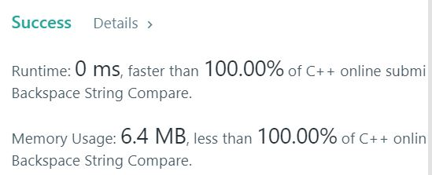

# 844. Backspace String Compare
Given two strings S and T, return if they are equal when both are typed into empty text editors. # means a backspace character.  
**Note**
1 <= S.length <= 200
1 <= T.length <= 200
S and T only contain lowercase letters and '#' characters.

Can you solve it in O(N) time and O(1) space?

**Example1:**   
```
Input: S = "ab#c", T = "ad#c"
Output: true
Explanation: Both S and T become "ac".
```

**Example2:**   
```
Input: S = "ab##", T = "c#d#"
Output: true
Explanation: Both S and T become "".
```

**Example3:**   
```
Input: S = "a#c", T = "b"
Output: false
Explanation: S becomes "c" while T becomes "b".
```

## trial1
### Intuition
```
stack의 성질을 이용하였다.
S와 T에 대하여 현재 인덱스 "i"번째 값이 "#" 라면 s의 가장 마지막 값을 pop 해주고 아니라면 push 해주는 방식을 사용하였다.

The properties of the stack were used.
For S and T, if the current index "i" th value is "#", the last value of "s" or "t" is popped and pushed if not.
```
### Codes  
```cpp
class Solution {
public:
	bool backspaceCompare(string S, string T) {
		string s, t;
		int j = 0,i;
		for (i = 0; i < S.size(); i++) {
			if (S[i] != '#') {
				s.push_back(S[i]);
			}
			else if(!s.empty()){
				s.pop_back();
			}
		}
		for (i = 0; i < T.size(); i++) {
			if (T[i] != '#') {
				t.push_back(T[i]);
			}
			else if(!t.empty()){
				t.pop_back();
			}
		}
		return (s == t ? true : false);
	}
};
```

### Results (Performance)  
**Runtime:**  0 ms O(n)의 runtime을 가지고 있다.
**Memory Usage:** 	6.4 MB

<p align="center"> 

</p>


### 문제 URL (LeetCode)  
https://leetcode.com/problems/backspace-string-compare/