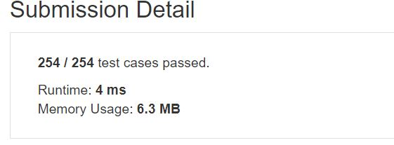

# First Bad Version
You're given strings J representing the types of stones that are jewels, and S representing the stones you have.  Each character in S is a type of stone you have.  You want to know how many of the stones you have are also jewels.  

The letters in J are guaranteed distinct, and all characters in J and S are letters. Letters are case sensitive, so "a" is considered a different type of stone from "A".  


## Example1

```
Input: J = "aA", S = "aAAbbbb"
Output: 3
```
## Example1

```
Input: J = "z", S = "ZZ"
Output: 0
```

## trial1
### Intuition
```
J에 있는 character들을 unordered_map에 넣고 S에 대해서 한 글자씩 반복문을 돌려주어 map에 존재하는지 확인하여 cnt를 증가시켜주었다.


I put the characters in J into unordered_map and return a loop for each letter for S to check if it exists in the map and increase the cnt.
```
### Codes  
```cpp
class Solution {
public:
    int numJewelsInStones(string J, string S) {
        int cnt=0;
        unordered_map<char,bool> m;
        for(int i=0;i<J.size();i++){
            m[J[i]]=true;
        }
        for(int i=0;i<S.size();i++){
            if(m.find(S[i])!=m.end()){
                cnt++;
            }
        }
        return cnt;
    }
};
```

### Results (Performance)  
**Runtime:**  4 ms
**Memory Usage:** 	6.3 MB


<p align="center"> 

</p>


### 문제 URL (LeetCode)  
https://leetcode.com/explore/challenge/card/may-leetcoding-challenge/534/week-1-may-1st-may-7th/3317/