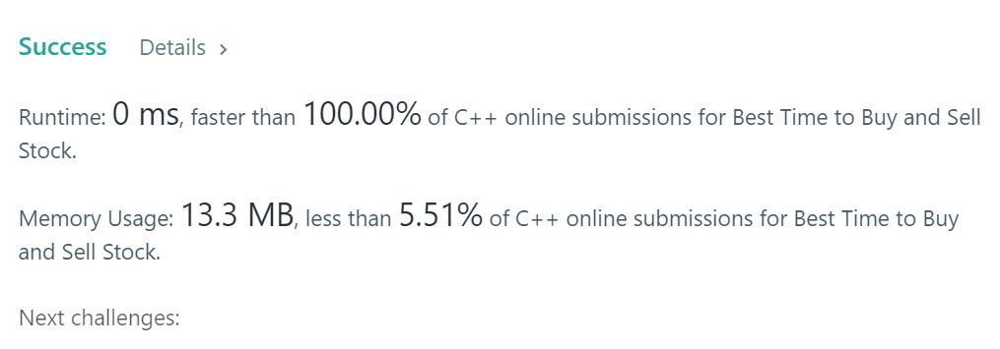

# 62. Unique Paths
Say you have an array for which the ith element is the price of a given stock on day i.

If you were only permitted to complete at most one transaction (i.e., buy one and sell one share of the stock), design an algorithm to find the maximum profit.

Note that you cannot sell a stock before you buy one.

## Example1

```
Input: [7,1,5,3,6,4]
Output: 5
Explanation: Buy on day 2 (price = 1) and sell on day 5 (price = 6), profit = 6-1 = 5.
             Not 7-1 = 6, as selling price needs to be larger than buying price.
```

## Example2

```
Input: [7,6,4,3,1]
Output: 0
Explanation: In this case, no transaction is done, i.e. max profit = 0.
```

## trial1
### Intuition
```
single pass로 가장 작은 값이 나왔을때는 현재 smallest인 cursm을 업데이트하고 cursm보다 p[i] 값이 더 크다면 
두 사이의 차와 현재 최대 차이(diff)중 비교하여 그 차이가 더 큰값으로 diff를 업데이트 해준다.

I used single pass algorithm. 
When the smallest value comes out, update the current smallest cursm, and if p [i] is greater than cursm
The difference between the two and the current maximum difference (diff) is compared and the difference is updated to a larger value.
```
### Codes  
```cpp
class Solution {
public:
    Solution() {
        cin.tie(nullptr);
        cout.tie(nullptr);
        ios::sync_with_stdio(false);
    }
    int maxProfit(vector<int>& p) {
        if (p.size() == 0) return 0;
        int cursm = p[0],diff=0;

        for (int i = 1; i < p.size(); i++) {
            if (cursm < p[i]) {
                diff=max(p[i] - cursm,diff);//diff가 가장 큰것 가져오기
            }
            else if (cursm > p[i]) {
                cursm = p[i];//가장 작은값으로 업데이트
            }
        }
        return diff;
    }
};
```

### Results (Performance)  
**Runtime:**  0 ms O(n)  
**Memory Usage:** 	13.3 MB  

<p align="center"> 

</p>


### 문제 URL (LeetCode)  
https://leetcode.com/problems/best-time-to-buy-and-sell-stock/