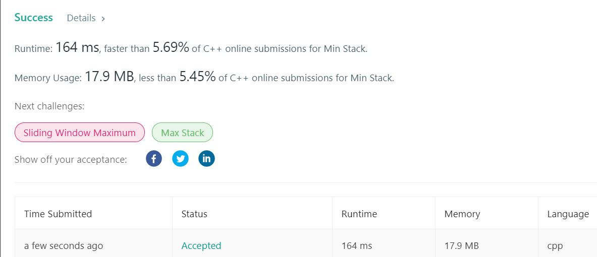

# 155. Min Stack
Design a stack that supports push, pop, top, and retrieving the minimum element in constant time.

push(x) -- Push element x onto stack.
pop() -- Removes the element on top of the stack.
top() -- Get the top element.
getMin() -- Retrieve the minimum element in the stack.


**Example1:**   
```
MinStack minStack = new MinStack();
minStack.push(-2);
minStack.push(0);
minStack.push(-3);
minStack.getMin();   --> Returns -3.
minStack.pop();
minStack.top();      --> Returns 0.
minStack.getMin();   --> Returns -2.
```

## trial1
### Intuition
```
1.  Minstack을 실행할때 조건이 getMin() 함수가 실행될때 상수시간이 걸려야 한다고 하였기 대문에 heap과 같이 제일 위에 있는 값을 가져오도록 코드를 작성하였다.
2.  pop이라는 함수는 가장 마지막에 들어온 값을 삭제하는 것이기 때문에 vector을 사용해서 들어온 순서를 저장하여 마지막에 들어온 숫자에 대해서 min heap에서 찾아서 없애주었다.

1. When running Minstack, the condition said that it must take a constant time when getMin() function is executed, so the code was written to get the top value like heap.
2. Since the pop function is to delete the last entered value, order for insertion of number is stored in the vector, and the last number inserted should be found and removed from the min heap.
```
### Codes  
```cpp
class MinStack {
public:
	vector<int> arr;
	priority_queue<int,vector<int>,greater<int>> min;
	/** initialize your data structure here. */
	MinStack() {
	}

	void push(int x) {
		arr.push_back(x);
		min.push(x);
		
	}

	void pop() {
		int tmp = arr.back();
		arr.pop_back();
		priority_queue<int, vector<int>, greater<int>> tmp2;
		bool one = false;
		while (!min.empty()) {
			if (min.top() != tmp || one) {
				tmp2.push(min.top());
				min.pop();
			}
			else {
				one = true;
				min.pop();
			}
		}
		min = tmp2;
	}

	int top() {
		return arr[arr.size()-1];
	}

	int getMin() {
		return min.top();
	}
};
```

### Results (Performance)  
**Runtime:**  164 ms         
**Memory Usage:** 17.9 MB

<p align="center"> 

</p>

위의 방법은 상대적으로 pop 하는 과정이 느린것으로 판단된다. 그리고 vector와 min heap을 사용함으로써 메모리면에서도 많은 용량을 차지한다.   

The above method is considered to be a relatively slow process of popping. And by using vector and min heap, it takes up a lot of memory.  


### Discussion
 

### 문제 URL (LeetCode)  
https://leetcode.com/problems/min-stack/