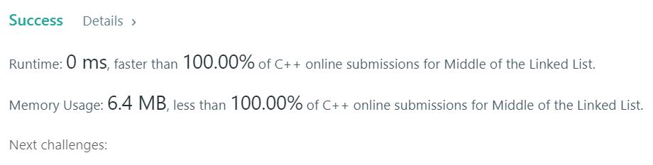

# 876. Middle of the Linked List
Given a non-empty, singly linked list with head node head, return a middle node of linked list.  

If there are two middle nodes, return the second middle node.  

 

**Note**
The number of nodes in the given list will be between 1 and 100.  

**Example1:**   
```
Input: [1,2,3,4,5]
Output: Node 3 from this list (Serialization: [3,4,5])
The returned node has value 3.  (The judge's serialization of this node is [3,4,5]).
Note that we returned a ListNode object ans, such that:
ans.val = 3, ans.next.val = 4, ans.next.next.val = 5, and ans.next.next.next = NULL.
```

**Example2:**   
```
Input: [1,2,3,4,5,6]
Output: Node 4 from this list (Serialization: [4,5,6])
Since the list has two middle nodes with values 3 and 4, we return the second one.
```

## trial1
### Intuition
```
LinkedList의 개수를 모두 카운트 하여 중간값을 구한 후에 "cur" 포인터를 중간값까지 이동시켜준다.

After counting the total number of LinkedLists to obtain the median value, move the "cur" pointer to the median value.
```
### Codes  
```cpp
class Solution {
public:
	ListNode* middleNode(ListNode* head) {
		int i = 0;
		ListNode * cur = head;
		while (cur != NULL) {
			i++;
			cur = cur->next;
		}
		i = floor(i / 2);
		cur = head;
		while (i > 0) {
			i--;
			cur = cur->next;
		}
		return cur;
	}
};
```

### Results (Performance)  
**Runtime:**  0 ms 
**Memory Usage:** 	6.3 MB

<p align="center"> 

</p>


### 문제 URL (LeetCode)  
https://leetcode.com/problems/middle-of-the-linked-list/